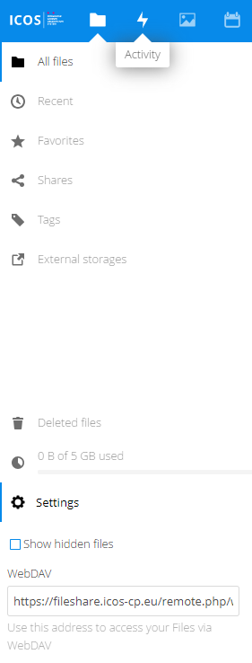

==================
Advanced functions 
==================

Accessing fileshare data through WEBDAV
---------------------------------------

When you open the Settings section in the App information field on the left you will see the WebDAV address of the Fileshare server. You can use this address to link your local computer to the Fileshare server and have the Fileshare data linked as a local drive or folder. Depending on your Operation system this is an easy (MacOS, Linux) or frustrating task (Windows).   

This is the current WebDAV address of the ICOS fileshare: 
https://fileshare.icos-cp.eu/remote.php/webdav/

Syncing Fileshare data with your local computer
-----------------------------------------------

Nextcloud provide a set of apps that allows you to sync your Fileshare drive to a local folder on your computer. Apps exists for MacOS, Linux and Windows. The apps can be downloaded at https://nextcloud.com/clients/ . After installation of the right version for your computer you can select which folders need to be synchronised.

Accessing data from another cloud server
----------------------------------------

You can also connect to other cloud storage from for example other Nextcloud, Owncloud servers or even sftp and other WebDAV services from https://fileshare.icos-cp.eu/settings/user/externalstorages   

Accesing Fileshare from your mobile phone
-----------------------------------------

Nextcloud provide a set of clients that allow you to connect to Nextcloud systems like the ICOS Fileshare through your mobile phone. The clients for iOS and Android can be downloaded at:
https://nextcloud.com/install/#install-clients. From within the ICOS Fileshare there is this link: https://fileshare.icos-cp.eu/settings/user/sync-clients 