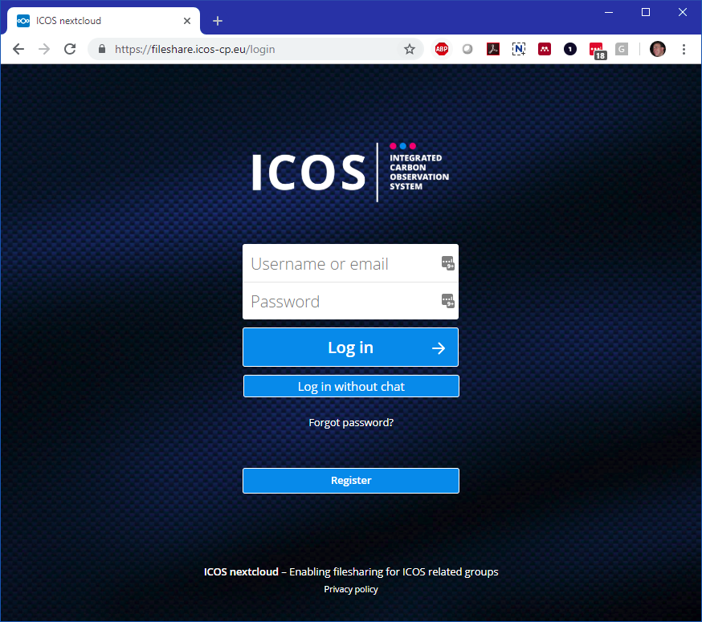
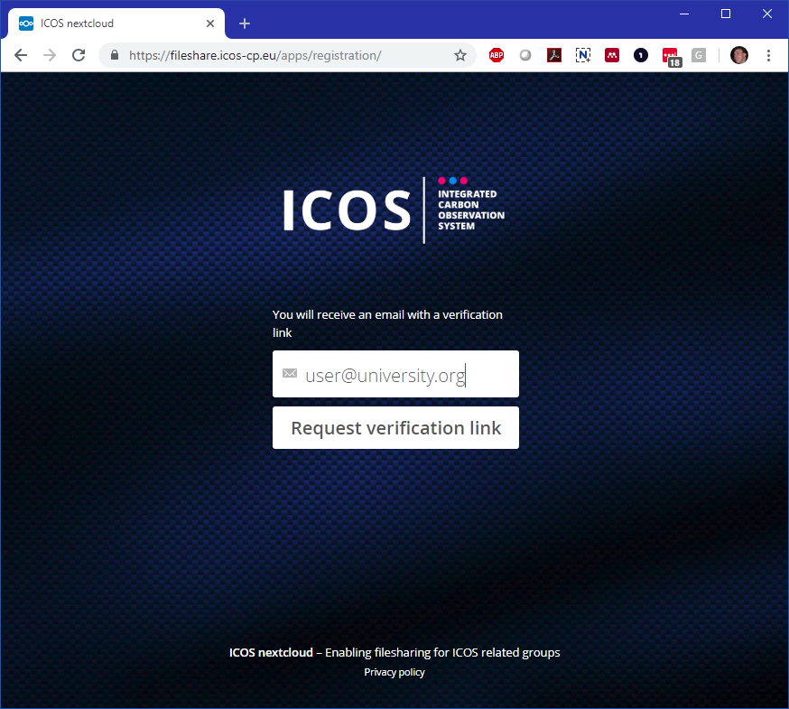
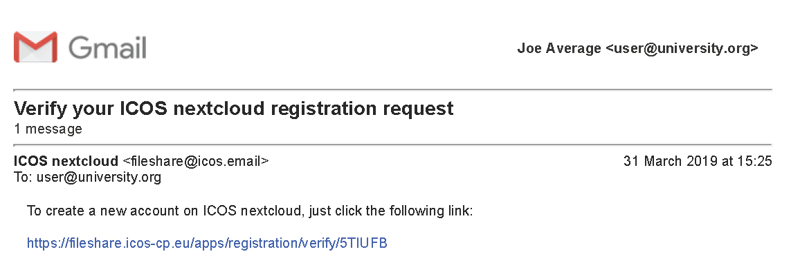
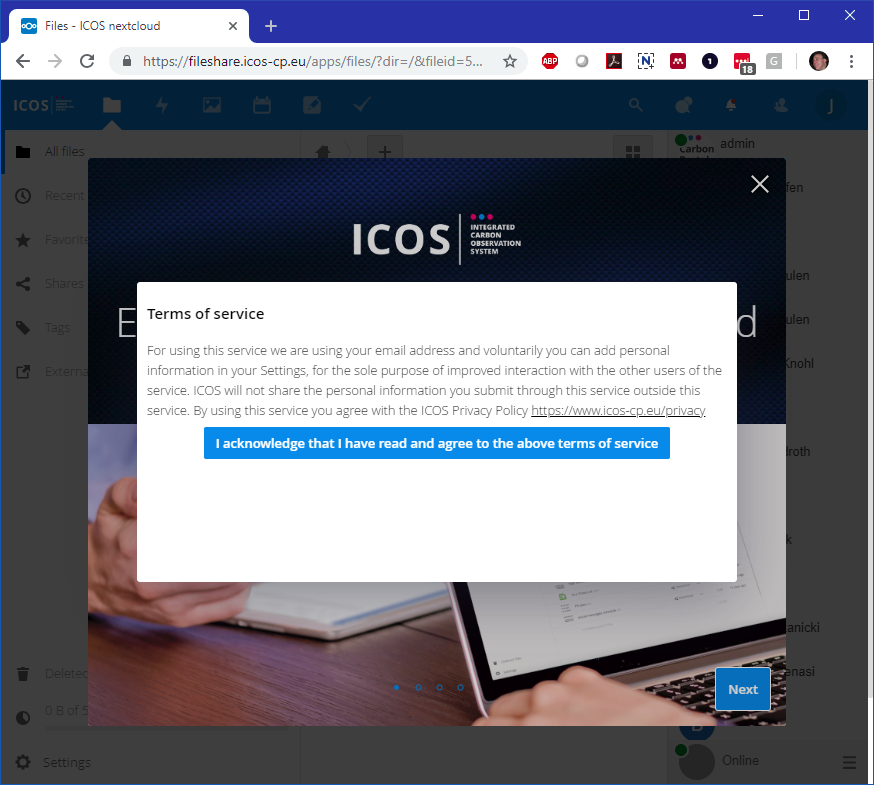

=========
First use 
=========

The ICOS fileshare is a service based on the Nextcloud server software and can be reached using your favourite web browser from https://fileshare.icos-cp.eu. At first use it will show you the login screen, that also allows you to register for an account:

At first use you need to register and confirm your email address. You can do this by pressing the Register button and fill in a working email address that will be connected to your account.

Then press the Request verification link button. An email will be sent to the email address. Please note that the email could arrive in your spam box. If so, please add the the sender of this email to your email white list. If all is well you will receive an email like below.

Please click on the link contained in the email. You will be directed to a new browser tab where you can choose a Username and Password. Please choose a user name that is the same or clearly related to your actual name as this allows other users to recognize your name when sharing data with you. Spaces are allowed in the user name, so you can use you first- and lastname, for example: Joe Average.

.. image:: register2.png

Then press the Create account button. After a few seconds Fileshare will confirm you that the account has been created and that it is awaiting approval by an administrator of the Fileshare. This will usually happen within 1 working day. The administrator, who receives an email of your registration,  will also add you to the groups that you will have access to, based on your name and email address.

.. image:: approved.png

After approval, of which you won't get an email, you can login to Fileshare through the login page at https://fileshare.icos-cp.eu. Use your Username or email address and password you selected before and press the Log in button. The Log in without chat saves you the annoying list of users when you do not want to use the chat function in your session. 

Please note that there is a forgotten password link on the login page that allows you to choose a new password through an email verification step like in the registration.

After logging in the first time you will be bothered by the Privacy policy acceptance dialog. Each time we change the policy you will be asked for confirmation again. 

After accepting the privacy policy you can read some information of the Nextcloud software, you can click through using the Next buttons. Finally then you will arrive at your main personal Fileshare data page. Each user gets 5 Gigabyte personal storage space that is only accesible to that user, unless of course you opt to share folders or files.

.. image:: firstscreen.png

As a default all users are member of the Guest group that all have acces to the shared ICOS PUBLIC group folder. The default installation also adds some example folders and files to your private space that you can delete as you wish. The Nextcloud Manual.pdf in your root folder is a very good introduction in the use of the Fileshare.