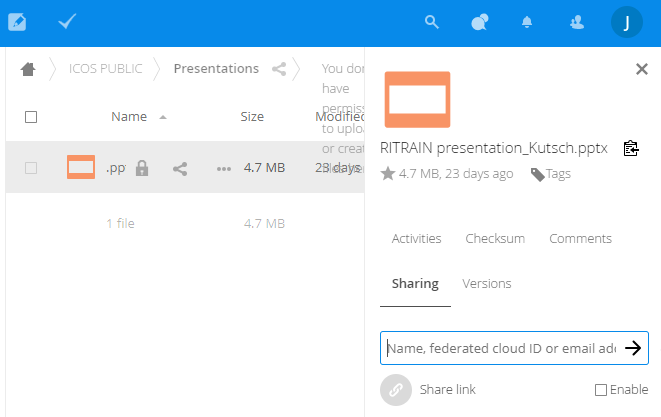
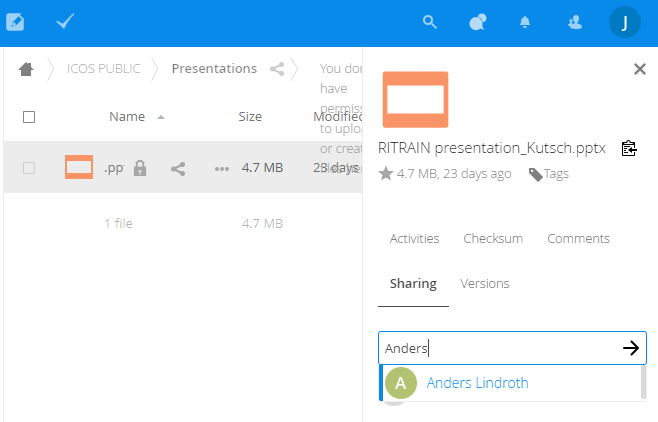
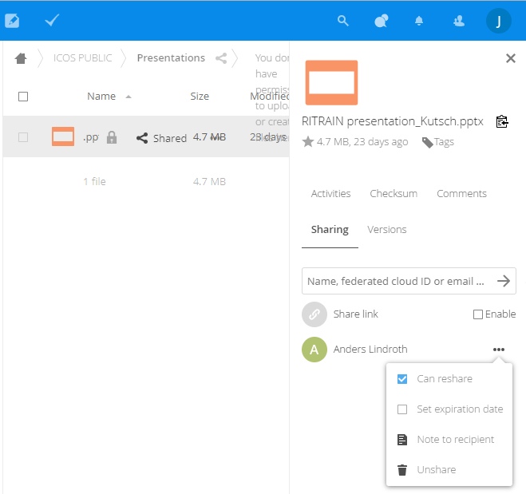
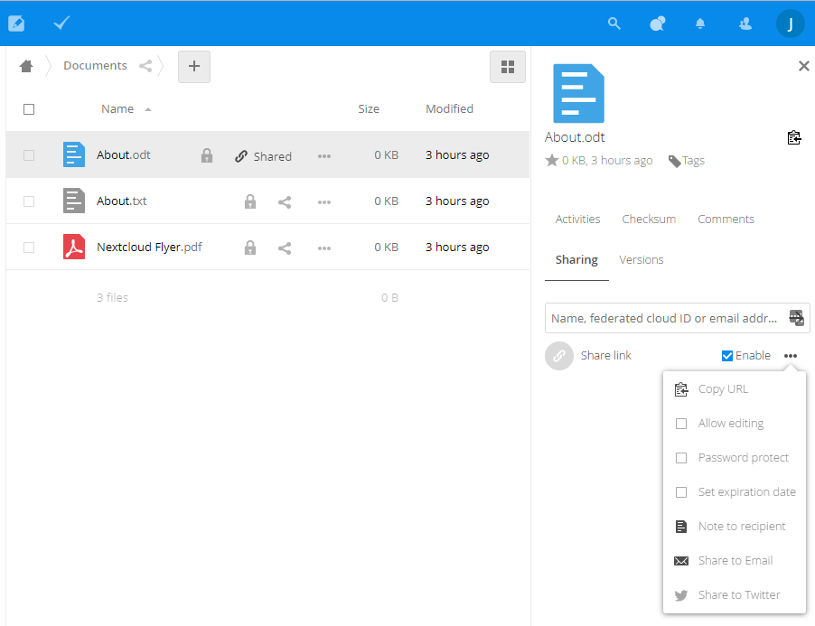
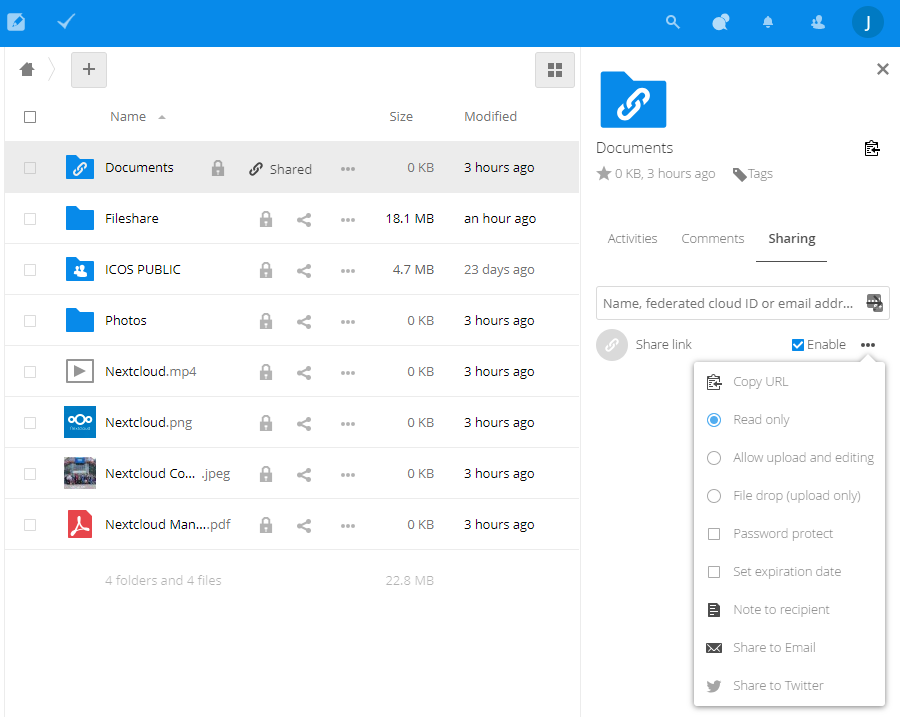

=================
Sharing your data 
=================

In Fileshare there are different folder icons. Your personal folders are coloured plain blue. Folders that are part of a Group structure have a white group icon inside and shared folders have a white share sign inside. Please consider this when sharing folders and files from Group structures and only share those folders or files therein publicly where this is really allowed and useful. 

Sharing a single file or folder with other users or group within Fileshare
--------------------------------------------------------------------------
Right click on the file or folder and select Share File from the popup menu. You can also click on the share icon on the right of the file or folder in the list. A side bar will appear as below

Start typing a name in the edit box until you see the correct person or group name that you are member of and select that, like in the below example for a user called Anders Lindroth. You can also identify a person by using a federated cloud ID, for example on the ACTRIS Nextcloud or some other nextcloud or owncloud server. In the example below the user that shared did not have write access to the file, so he can only give read access to the shared file. In case you share a file or folder to which you have access to modify, you can choose to only either give read or give full access to the file or folder. These permissions can all be changed at any time later.

This user will get an email that a share has been created and he will see the shared file(s) and folder(s) in his root directory of the fileshare. The share information is shown in the share side bar where you can see all persons or groups for which the folder or file has been shared. When you click on the ... icon next to the user or group name you can modify the share setting and even undo the sharing by selecting unshare. You can also set an expiration date of the share and disbale the user or group to reshare the share again with others. 

Sharing by link to any person
-----------------------------

By sharing through a link you can share the files or folders also with people that do not have an account at the fileshare. To do that you enable the Share link option in the share side bar. Several options exits from the popup menu that you can get by clicking on the ... icon next to the link option. You can share the link directly from the context menu by email or Twitter. 

The Copy URL option copies the URL of the link to share to the clipboard so that you can share this through an email by pasting the link in the email text. There are some additional settings compared to the standard sharing. Now you can allow editing of the file (using the OnlyOffice online editor). You can add a password for additonal security only to share with the persons that are allowed to access the files in the case that the link gets known outside the desired persons. 

A share by link for a folder has even more options to set. See below the context menu you will get when you click on the ... icon next to the Share link option. 

If you share a folder you can set the access to allow read-only, upload only (filedrop) or allow upload and editing.