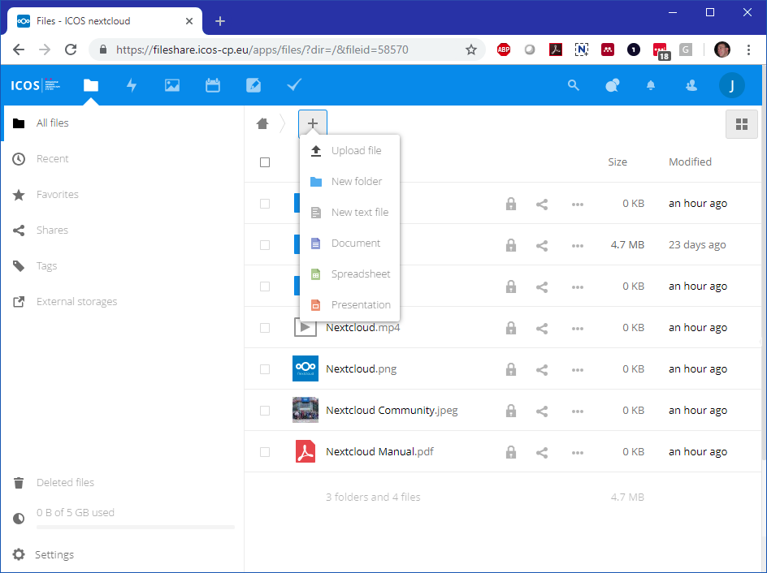
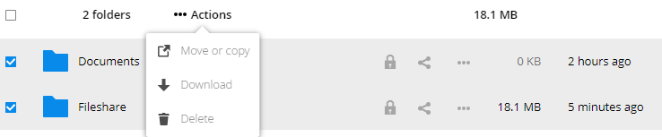

==================
Managing your data 
==================

By clicking the Plus(+) icon next to your home button in the application window you can create a new folder or file. 

When you choose Document, Spreadsheet or Presentation and have entered a filename the system will directly take you in a new tab to the built-in OnlyOffice document server where you can edit your file. You can exit the editor through the file menu (under the small doc icon on the left) or by pressing the Go to Documents link on the top right of the editor window.  

Fileshare has also a built-in editor for plain text files and previews for PDF, picture formats and some movie formats.

When you use the Edge, Firefox, Chrome or Chromium browser you can drag files and folders from your desktop or explorer into the fileshare file list to copy files into the fileshare. Otherwise use the Upload option, also under the Plus(+) icon   

Right clicking on a file/folder or clicking on the ...-icon next to the file/folder name opens a context menu like shown here.

.. image:: context.png

From this menu you can delete or move/copy the file or folder. Deleted files will be moved to the Deleted file folder that is accesible on the down left. From there you can restore the deleted files or permanenetly delete the files. 

The details option allows you to see the history of the file, a small preview, the different versions and revert to older versions. You can also add comments and if you right clicked change the sharing options. 

This context menu is also the way to download files or folders to your local machine. A folder will be compressed on the fly into a zip file with the same name.

You can always use the select boxes left of the file and folder names to (de)select multiple files and then select the actions possible for the selection from the ...Actions menu that will shown on top as soon as you made a selection. 