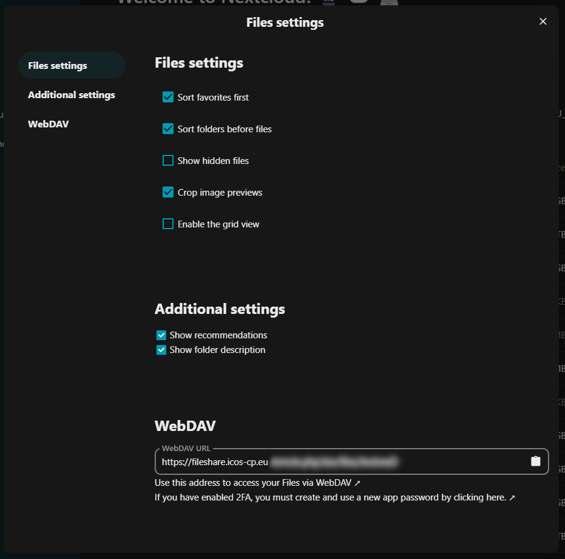

# Advanced functions

## Accessing fileshare data through WebDAV

You can access your Fileshare data using your WebDAV address. Within the Files
app, click on the **Files settings** link in the bottom left corner of the
screen, within the App information section. In the Files settings window, you
can view the WebDAV address of the Fileshare server. You can use this address to
link your local computer to the Fileshare server and have the Fileshare data
linked as a local drive or folder. Depending on your operating system, this is
either an easy (MacOS, Linux) or frustrating task (Windows).   

## Syncing Fileshare data with your local computer or mobile phone

Nextcloud provide a set of apps that allows you to sync your Fileshare drive to
a local folder on your computer, or to access files/folders from your mobile
phone. Desktop apps exists for MacOS, Linux and Windows, and mobile apps for
Android and iOS. After installation, you can select which folders and files need
to be synchronised.

To download the apps, you can visit either:

- [The ICOS Fileshare settings
  page](https://fileshare.icos-cp.eu/settings/user/sync-clients)
- [Nextcloud's Install Clients
  page](https://nextcloud.com/install/#install-clients)

## Accessing data from another cloud server

You can also connect to other cloud storage services, for example, other
Nextcloud servers, Owncloud servers or even sftp and other WebDAV services from
the [External storage
settings](https://fileshare.icos-cp.eu/settings/user/externalstorages).

