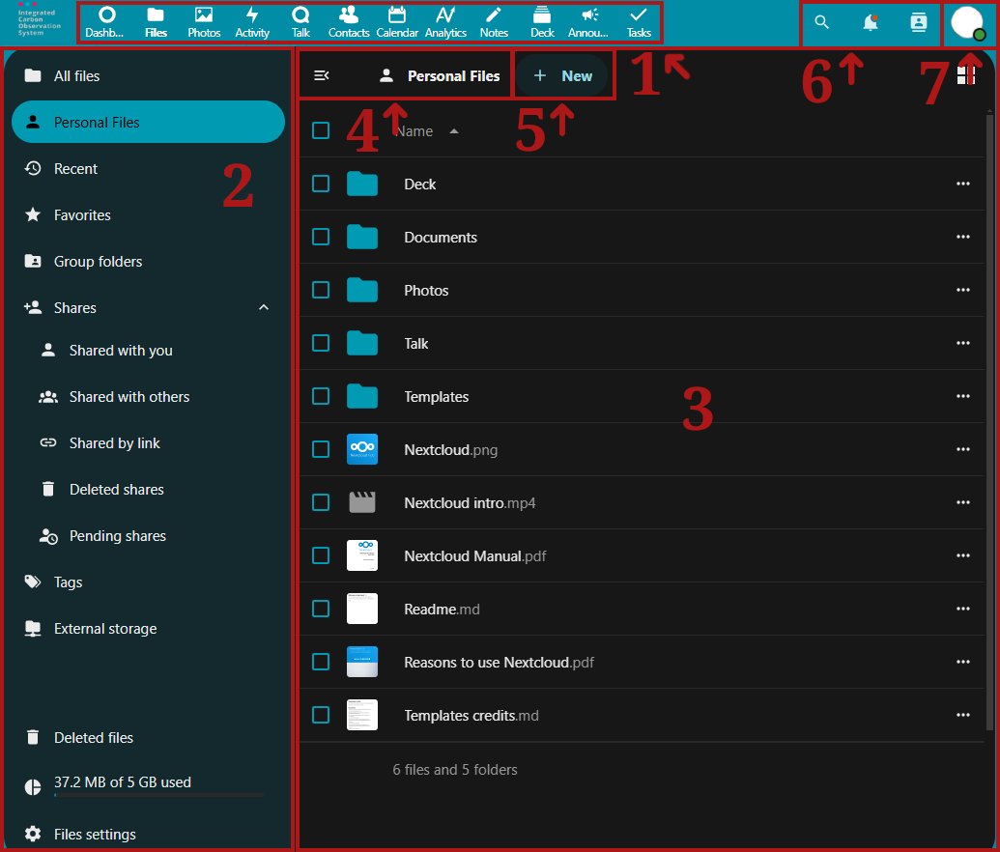

# Becoming familiar with ICOS Fileshare

In ICOS Fileshare there are different folder icons. Your personal folders are
solid blue, while folders that are part of a Group structure have a group icon
on the folder and shared folders have a sharing icon on them. 

!!! note 
    When sharing folders and files from within Group structures, only share
    folders or files therein publicly when it is safe, necessary, and useful.

By default, the Nextcloud Web interface opens to a Dashboard page. From here,
the icons along the top of the screen can be used to change between apps within
the Fileshare. The most used app is the Files app, represented by the Folder
icon. Here, you can add, remove, and share files, and make changes based on the
access privileges you have.

The Nextcloud user interface contains the following fields and functions:

1. **App Selection Menu:** Located in the upper left corner, you'll find all
   your apps which are available to you. Clicking on an app's icon will redirect
   you to the app.
2. **App Information:**  Located in the left sidebar, this area contains filters
   and tasks associated with your selected app. For example, when you are using
   the Files app, you have a special set of filters for quickly finding files,
   including Personal Files, Shared with you, or Group folders. You'll see
   different options here for the other apps.
3. **App View:** The main central field in the Nextcloud user interface. This
   field displays the contents or user features of your selected app.
4. **Navigation Bar:** Located over the main viewing window (the Application
   View), this bar provides a type of breadcrumbs navigation that enables you to
   navigate back to higher levels of the folder hierarchy up to the root level.
5. **New Button:** Located to the right of the Navigation Bar, the New button
   enables you to create new files, new folders, or upload files.

!!! note 
    You can also drag and drop files from your file manager into the Files
    Application View to upload them to your instance. Currently, the only Web
    browsers that support drag-and-drop folders are Chrome and Chromium.

6. **Search, Notifications, Contacts:** In the upper right, to the left of the
   profile picture, you can find the Search feature (magnifying glass), as well
   as the Notifications (bell) and the Contacts (person).
7. **Personal Settings:** Click on your profile*photo, located to the right of
   the Search field, to open a quick access drop-down menu, allowing you to
   access more settings. The Personal settings area will allow you access many
   settings by navigating the left-hand App Information drop-down menu,
   including the following:

    - **Personal info:** Edit your profile.
    - **Security:** Change your password or manage your sessions.
    - **Notifications:** Enable email or app notifications when different
      activities happen.
    - **Mobile & desktop:** Links to download mobile or desktop apps.
    - **Appearance and accessibility:** Change between light and dark mode,
      enable high contrast mode, and configure navigation bar settings.
