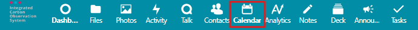
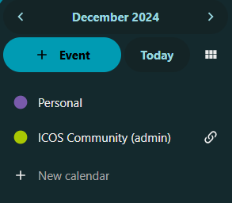
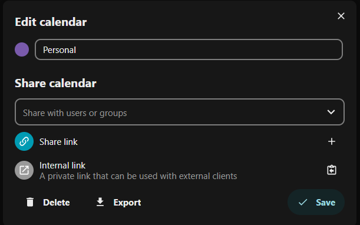
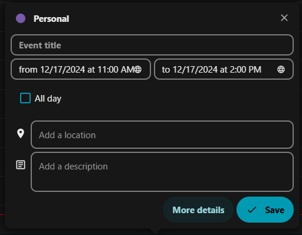

# Calendars in Fileshare

In addition to managing and sharing files, ICOS Fileshare also has a Calendar app that can be used to manage your personal calendar, view shared calendars, and sync these calendars with other online calendar services.

To access the Calendar app, click on the **Calendar icon** in the App Selection Menu, in the top right section of the screen.

## Navigating the Calendar app

The main section of the screen contains the calendar view, showing you upcoming events.

The left section of the screen (the App Information panel) contains controls for changing the calendar view and a list of calendars that you have access to. (If the list is not visible, you can click on the menu icon with three horizontal lines in the upper left corner of the calendar display.) By default, you should see your Personal calendar as well as the ICOS Community (admin) calendar. The "admin" portion of the name indicates that the calendar is owned by the "admin" account; any other shared calendars you have access to will show you the name of the calendar owner in parentheses as well.

### Changing calendar view

When you first visit the Calendar app, you will be shown the Monthly view. You should see the entire current month in the main portion of the screen, and the month name and year at the top of the left panel. 

This is called the **Visible time period**, and you can click on the visible time period (month name/year) to select a different month, or use the arrows to the left and right of the month name and year to navigate to different months.

The **+ Event** button allows you to create a new event; we will discuss this in the [Creating and editing events](#creating-and-editing-events) section.

To navigate back to the current month/year, click on the **Today** button.

To change between views, click on the **change view** icon, located to the right of the **Today** button. Note that the icon changes to display which view you currently have selected.

In the change view menu, you can select between Day, Week, Month, Year, and List. Selecting a different view will update the main section of the screen accordingly, and change the Visible time period accordingly. You can then navigate to different Days, Weeks, Months, or Years using the arrows or by clicking on the **Visible time period**.

### Managing individual calendar settings

In the list of calendars, you can click on the colored circle icon to toggle the visibility of the calendar. A solid circle indicates the calendar is currently visible, while an empty circle indicates it is currently hidden.

To reorder the list of calendars, click on a calendar's name and drag the calendar to its desired position in the list.

!!! note
    The first calendar on the list you have editing access to will be the **default calendar** selected when you create new events. So if you do not use the Personal calendar but make events on a shared calendar, you may want to move the shared calendar to the top position!

To edit a calendar, hover over the calendar name and then click on the icon to the right of the calendar. For calendars you own, this will be a pencil icon and the edit menu will open immediately; for calendars shared with you, this will be a link icon, replaced with a ... icon after you hover over it, and then you can click on the **Edit calendar** option.

Depending on the kind of calendar, you have different options. Remember to click **Save** after making changes in order for them to be applied.

For any calendar:

- You can change the displayed color by clicking on the solid circle next to the calendar name in the Edit calendar pop-up.
- You can change the displayed name by changing the calendar name.
- You can export the calendar, downloading a .ics file that can be imported into other services. Note that this is a **snapshot** or copy of the current calendar; it will not sync with future updates. 

For calendars you own:

- You can share the calendar with other Fileshare users or groups. Type the user/group name in the *Share with users or groups* search box, then click on the user. You can give the user permission to edit the calendar by enabling the "can edit" option next to their name, below the search box.
- You can generate a share link to share the calendar publicly. Click on the **+** (plus sign) icon, then you can click on the clipboard icon to copy the link. For more options, click on the **...** icon that is now present; from here, you can email the calendar link, copy it, copy an embedding code, or delete the share link.
- The **Internal link** section allows you copy an internal WebDAV link, which you can then use to sync your calendar with other calendar systems. For more information about this, see [Syncing calendar with other systems](#syncing-calendar-with-other-systems) section.
- You can delete the calendar.

For calendars shared with you:

- You can remove the calendar using the **Unshare from me** option. Note that hiding the calendar is usually a better option than removing it entirely!

## Creating and editing events

There are two ways to create a new event:

1. Click on the **+ Event** button in the left panel (App Information).
2. Click directly on the calendar. 
    - In the Year or Month view, you can click on a specific day to create an event on that day. 
    - In the Week or Day view, you can click and drag to create an event at a specific time on that day.

Either way will open the **Create event** dialog box, shown below.

Here, you can enter an *Event title*, change the *start* and *end* times (or enable the *All day* for events with no specific start/end times), and optionally add a location and/or description.

If you have editing access to multiple calendars, you can select which calendar the event appears on by clicking on the calendar name in the upper left of the dialog box.

For more advanced features, click on the **More details** button. This will open a panel on the right side of the screen, with three sections:

1. Details
    - Set the status of the event: Confirmed, Tentative, or Canceled
    - Set the visibility of event when shared: Show full details, Show as busy, or Hide event
    - Set how the event impacts your status: Busy or Free
    - Categorize your event
    - Give your event a custom colour, which will be different from the calendar default
    - Add a reminder for the event
    - Change recurrence: Does not repeat or repeating event. If repeating, you can set how often it repeats and when to end the recurring event.
    - Attach files to the event
2. Attendees
    - Invite other people to the event. This can include Fileshare users or groups, or you can type any email to email an invitation to the event to that person. You can also view if people you invited have accepted the invitation.
3. Resources - *this section is not currently in use*

!!! note
    To edit an existing event, click on the event and then click **Edit event**. From here, you should be able to change the settings above, just as if you were creating a new event. This includes moving it to a different calendar by clicking on the calendar name in the upper left of the dialog box.

## Syncing calendar with other systems

There are two main methods of syncing your Fileshare calendar with other systems:

1. [Full synchronization](#full-synchronization-with-caldav) of any calendar you have access to, which works only with calendar applications that allow for CalDAV synchronization.
2. [Read-only synchronization](#read-only-synchronization-with-subscription-link) of calendars you own, which works with nearly any calendar system.

!!! note
    If you would like help with synchronizing your ICOS Fileshare calendar with another calendar application, please email us at <help@icos-ri.eu>.

Both methods will be presented in the general case, with platform independent instructions, along with guides for specific applications, as shown in the table below.

| Environment   | Application                                           | Method                    |
|---------------|-------------------------------------------------------|---------------------------|
| Windows 10/11 | [Outlook (classic)\*](#windows-1011-outlook-classic)  | Full synchronization      |
| macOS/iOS     | [Apple Calendar App](#macosios-apple-calendar-app)    | Full synchronization      | 
| Windows 10/11 | [Outlook (new)](#windows-1011-outlook-new)            | Read-only synchronization |
| macOS         | [Outlook](#macos-outlook)                             | Read-only synchronization |
| --            | [Google Calendar](#google-calendar)                   | Read-only synchronization |

*\*Outlook (classic) on Windows requires a third-party Outlook add-on named* ***CalDav Synchronizer***.

### Full synchronization with CalDAV

You will need to provide the following information to your calendar application:

| Field               | Information                                               |
|---------------------|-----------------------------------------------------------|
| Server              | https://fileshare.icos-cp.eu/remote.php/dav               |
| Username            | *<Your ICOS Fileshare username\>*                         |
| Password            | *<Your ICOS Fileshare password or App Password\>*         |
| Description or name | ICOS Fileshare                                            |

If you use two-factor authentication, you will need to use a specific App Password instead of your account password.

You can generate an App Password by navigating to the Security settings page. Click on your profile picture in the upper right corner, then select **Personal settings**. From the left-hand App Information Panel, click on **Security**.

Scroll to the bottom of the page and find the *Devices & sessions* section. Click on the *App name* text box and type a short descriptive name (e.g., Apple Calendar or Outlook). Then click on the **Create new app password** button (the text on the button may be shortened to fit your view).

After authenticating with your password, the app password will be displayed. This is the only time the password will be displayed, so if you needed a password again, you would need to delete the existing password and create a new password to use.

#### Windows 10/11, Outlook (classic)

You will need to install an Outlook add-on, **CalDav Synchronizer**, in order to have full synchronization.

!!! warning
    The CalDav Synchronizer add-on is an open-source software package. There is no guarantee that it will continue to receive updates in the future, and upgrades to Microsoft Outlook could break the synchronization.

    Additionally, be aware that while the calendars will appear on all of your devices, they will not sync to ICOS Fileshare unless the Outlook (classic) application is open on the computer that has CalDav Synchronizer set up. If you use multiple computers, you should install and set up CalDav Synchronizer on each computer. In that case, when you are selecting an Outlook folder in step 5.4, select the already existing folder for that calendar.

1. Install the CalDav Synchronizer add-on after [downloading it from their website](https://caldavsynchronizer.org/download-2/). 
2. After installation, **restart Outlook (classic)** by closing the application and reopening it.
3. Click on the **CalDav Synchronizer** ribbon, at the top of the Outlook window.
4. Click on the **Synchronization Profiles** option to open the profiles window.
5. For each calendar you would like to synchronize:
    1. Click on the **+** (plus sign) icon in the upper left.
    2. Select **Nextcloud**, then click **OK**.
    3. Replace the text, *<New Profile\>*, next to Name: with the calendar's name.
    4. To the right of the Outlook folder option, click the **...** icon.
    5. Click on **Calendar**, and then click the **New...** button.
    6. Enter the name of the calendar as the Name, and then click **OK**.
    7. At this point you may need to find the profiles window (called "Options") again, as it may have become hidden behind the main Outlook window.
    8. Paste in the Dav URL for our server: *https://fileshare.icos-cp.eu/remote.php/dav*
    9. Provide the username, password, and email address.
    10. Click the **Test or discover settings** button.
    11. After a short delay, a window will pop up showing you the calendars you have access to. Select the correct one and click **OK**.
    12. CalDav Synchronizer will confirm it is connecting successfully. It may give you some extra information for shared calendars, which you can ignore.
6. After adding all the calendars you would like to use, click **OK** in the profiles window to close it.

#### macOS/iOS, Apple Calendar App

Instructions may vary depending on OS version, but should be relatively similar on each system.

These are the settings to use on a Mac:

| Field       | Information                                               |
|-------------|-----------------------------------------------------------|
| Server      | https://fileshare.icos-cp.eu/remote.php/dav               |
| Username    | *<Your ICOS Fileshare username\>*                         |
| Password    | *<Your ICOS Fileshare password or App Password\>*         |
| Description | ICOS Fileshare                                            |

!!! note
    If you have two-factor authentication enabled, use an App Password instead, as described in the [Full synchronization with CalDAV](#full-synchronization-with-caldav) section.

On macOS:

1. Open the **Calendar** app on your Mac.
2. From the top menu, select **Calendar**, then **Add Account**.
3. Select **Other CalDAV Account**, and then select **Manual**.
4. Provide the information from the table above.
5. Click **Next** to proceed.

On iOS (iPhone, iPad, etc.)

1. Open the **Settings** app.
2. Select the **Apps** option, and then select the **Calendar** app in the list.
3. In the top area, select **Calendar Accounts**, then select **Add account**.
4. Select **Other**.
5. In the Calendars section, select **Add CalDAV Account**.
6. Provide the information from the table above.
7. Click **Next** in the upper right.

After adding the account, your calendars should appear in the Calendar app right away, and should continue to sync with the Fileshare from your device. You may need to add the calendar account to other devices if you use multiple devices.

### Read-only synchronization with subscription link

Almost any calendar system will be able to read calendars you own. To add an owned calendar for read-only synchronization:

1. In ICOS Fileshare, go to the **Edit calendar** pop-up, as described in the [Managing individual calendar settings](#managing-individual-calendar-settings) section above. 
2. Next to Share link area, click on the **+** (plus sign) icon. 
3. Click on the **...** icon that replaces the plus sign icon, and select the **Copy subscription link** option. 
4. Go to your calendar system. Find a feature called either "Add a web calendar" or "Subscribe to calendar".
5. Provide the URL and any other information requested, then click to submit. Your calendar should now appear in your calendar system.

#### Windows 10/11, Outlook (new)

In the new Outlook app, labelled **Outlook (new)**, you can only add calendars you own with read-only synchronization. Follow steps 1-3 in the [Read-only synchronization with subscription link](#read-only-synchronization-with-subscription-link) section (above).

Then, in Outlook (new), click on the Calendars tab, then click the **Add calendar** button in the left panel, below the month grid display.

Select **Subscribe from web** on the left of the Add calendar pop-up, then paste the URL and click **Import**.

#### macOS, Outlook

In the macOS Outlook app, you cannot add any web-based calendars.

However, you should be able to add calendars you own with read-only synchronization by using the web client <https://outlook.office.com>. 

Follow steps 1-3 in the [Read-only synchronization with subscription link](#read-only-synchronization-with-subscription-link) section (above).

Then, in the Outlook web interface, click on the **Calendars** tab, then click the **Add calendar** button in the left panel, below the month grid display.

Select **Subscribe from web** on the left of the Add calendar pop-up, then paste the URL and click **Import**.

#### Google Calendar

Using the Google Calendar service, you can only add calendars you own with read-only synchronization. Follow steps 1-3 in the [Read-only synchronization with subscription link](#read-only-synchronization-with-subscription-link) section (above).

From the Google Calendar web app, click on the **+ (plus sign)** icon to the right of "Other calendars" in the left-hand sidebar.

Select **From URL**, then paste the URL and click **Add calendar**.

{!../contact_footer.md!}