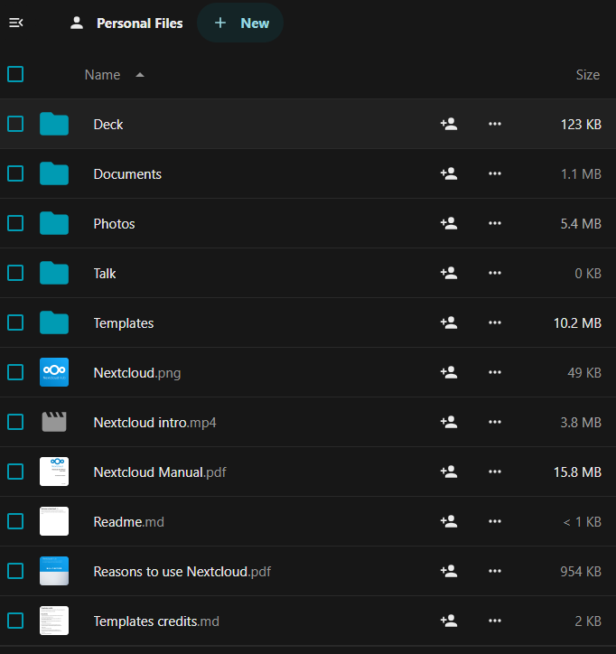

# Creating your account

There are two required steps for creating an account:

1. Fill out [the ICOS fileshare user information
   form](https://www.icos-cp.eu/form/icos-fileshare-user-information), which
   will allow us to give you access to the correct folders and files.
2. Register at [the ICOS Fileshare](https://fileshare.icos-cp.eu) by clicking
   the **Register** button at the bottom of the login area. For your login name,
   please choose a name that is the same or clearly related to your actual name,
   as this allows other users to recognize your name when sharing data with you.
   Spaces are allowed, so your first and last name can be used.

!!! note
    The verification request email may arrive in your spam box. If so, please
    add the the sender of this email to your email white list.

After completing the two above steps, our staff will verify your permissions and
enable your account, usually within 1-2 working days. You will receive an email
when your account is active.

Once your account has been approved, you can log in to [the ICOS
Fileshare](https://fileshare.icos-cp.eu). Use your Username or email address,
along with the password you selected before, then click the **Log in** button.

!!! note 
    If you cannot remember your password, there is a "Forgot password?" link on
    the login page that allows you to choose a new password through email
    verfication, similar to the registration process.

After logging in the first time, you will need to accept the Privacy Policy. If
we change the policy, you will be asked for confirmation again. 

Each user has 5 GB (gigabyte) personal storage space that is only accessible to
that user (unless, of course, you opt to share folders or files).

By default, all users are members of the **Guest** group that all have acces to
the shared ICOS PUBLIC group folder. You will also see that some example folders
and files have been created in your private space, which you can delete if
desired. The `Nextcloud Manual.pdf` in your root folder is a very good
introduction to the use of the Fileshare system.

!!! note 
    We highly recommend **ALL USERS** [enable two-factor
    authentication](enable_2fa.md) once their account is enabled in order to
    safeguard their account and ensure they have access to their data.