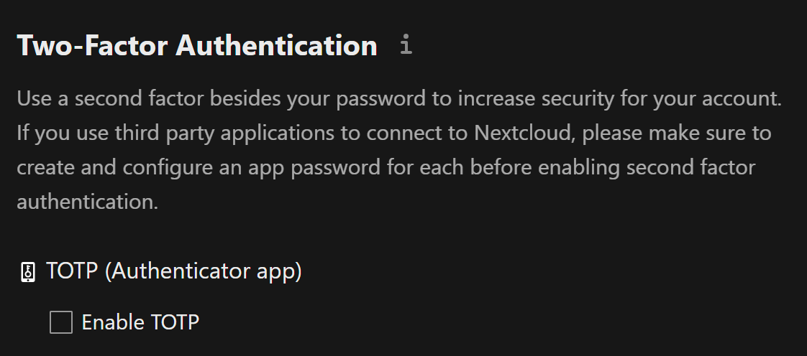
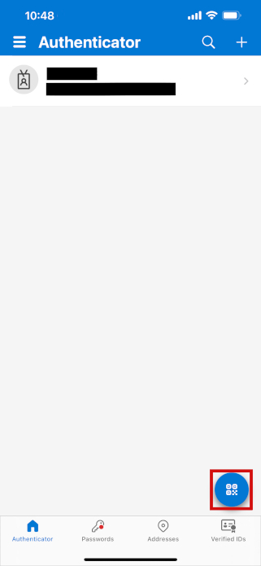
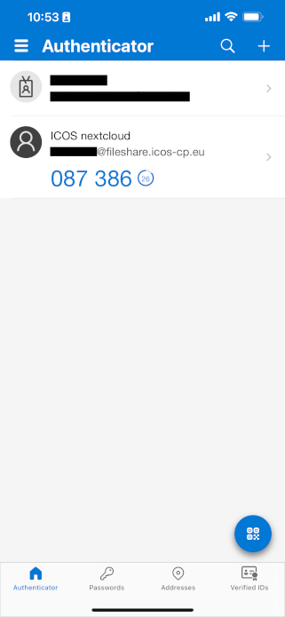
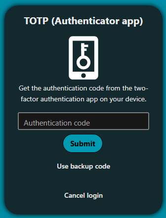

# Enable two-factor authentication

In order to safeguard your account and prevent lock-outs from possible
brute-force hacking attempts, we recommend all users enable two-factor
authentication (2FA) on their account. 2FA is a security feature requiring you
to authenticate yourself using a secondary device when you log in, most often a
mobile device.

## Install authenticator app

If you already have two-factor authentication set up, you may be able to use
your existing app for Fileshare as well. Fileshare is compatible with any
**time-based one-time password (TOTP)** authenticator.

Here is a list of some compatible apps, which can be installed on both Android
and iOS devices:

1. Microsoft Authenticator
2. Google Authenticator
3. Bitwarden

## Set up two-factor authentication on Fileshare

You can click on [Security settings
page](https://fileshare.icos-cp.eu/settings/user/security) to access it, or
click on your profile picture in the upper right corner, then **Personal
settings**, then **Security** ín the left pane.

Check the checkbox next to **Enable TOTP** to set up two-factor authentication.

A secret will be displayed, along with a QR code; the easiest way to set up 2FA
is to scan the QR code with your authenticator app.

Depending on the app and your device, the process will vary. Here is an example
using the Microsoft Authenticator app on an iPhone:

1. Open the app, and then tap on the QR code icon in the lower right corner of
   the screen.

2. If necessary, give the app permission to use your camera.
3. Scan the QR code.
4. Your account is now set up. You should see a six digit one-time passcode on
   your screen, with your account labelled as **ICOS nextcloud**.

## Log in with two-factor authentication

The next time you log in to ICOS Fileshare, you will be presented with another
dialog window after typing your password, asking you to enter the one-time
passcode (authentication code).

Open your authenticator app on your phone, type the provided six digit passcode,
and then click **Submit**. You should now be logged into ICOS Fileshare.

## Use backup codes

Below the TOTP (Authenticator app) section on the [Security settings
page](https://fileshare.icos-cp.eu/settings/user/security), there is an option
called **Backup code**.

If you click on the button to generate backup codes, you will be provided with
10 codes. These can be used to bypass two-factor authentication temporarily, in
case you do not have your phone or have no battery. You can save these somewhere
secure (for example, another cloud storage service or a secure password manager,
or written down at your desk) just in case you need them, and you don't need to
save all ten.

Once you've generated them, clicking **Regenerate backup codes** will invalidate
the existing codes and provide ten new codes.

{!../contact_footer.md!}