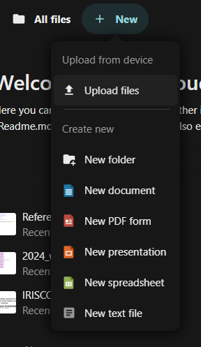
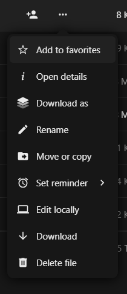
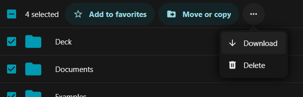

# Managing your data

First, ensure you are in the Files app by clicking on the Folder icon in the app
selection menu, at the top of the page. 

To create new folders or files, you can click the **+ New** button, at the top
of the application view. This opens a context menu allowing you to select which
kind of file you would like to add, shown below.

When you choose **New document**, **New spreadsheet** or **New presentation**
and have entered a filename, the system will directly take you to a new tab of
the built-in OnlyOffice application where you can edit your file. You can exit
the editor by closing the tab, or using the icon in the upper right of a folder
to view the file's location on the ICOS Fileshare.  

Fileshare also has a built-in editor for plain text files and previews for PDF,
picture formats and some movie formats.

When you use the Edge, Firefox, Chrome or Chromium browser you can drag files
and folders from your desktop or file explorer into the Fileshare file list to
copy files into the Fileshare. Otherwise, you can use the Upload option, also
under the **+ New** menu.   

Right clicking on a file/folder or clicking on the **...** icon next to the
file/folder name opens a context menu for managing the file/folder, shown below.

From this menu you can move, copy, or delete a file. Deleted files will be moved
to the Deleted files area, which you can find at the bottom left corner of the
window. From there, you can restore the deleted files or permanenetly delete
them.

The **Open details** option allows you to see the history of the file, a small
preview, the different versions of the file, and lets you revert to older
versions. You can also add comments and change the sharing options. 

This context menu is also the way to download files or folders to your local
machine. A folder will be compressed on the fly into a zip file with the same
name.

You can also select multiple files and/or folders by using the checkboxes to the
left of the file/folder icons. Then, the area below the navigation bar will
change to display the actions you can do, including **Move or copy**. Selecting
the **...** icon will show you more actions, including **Download** and
**Delete**.

{!../contact_footer.md!}