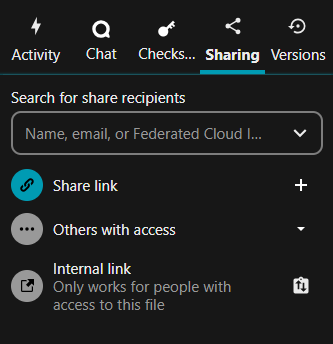
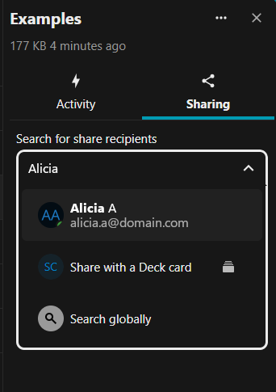
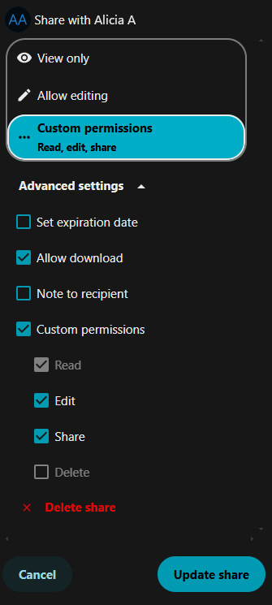
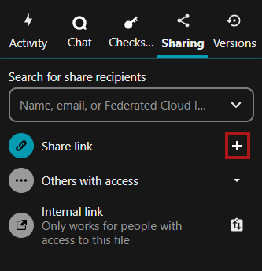
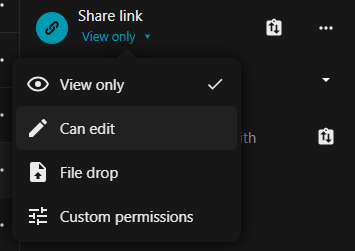

# Sharing your data 

In ICOS Fileshare there are different folder icons. Your personal folders are
solid blue, while folders that are part of a Group structure have a group icon
on the folder and shared folders have a sharing icon on them. 

!!! note
    When sharing folders and files from within Group structures, only share
    folders or files therein publicly when it is safe, necessary, and useful.

## Sharing a single file or folder with other users or a group within Fileshare

Right click on the file or folder and select **Open details** from the drop-down
menu. Then, click on the **Sharing** tab, if it is not already selected.
(Alternatively, you can click on the share icon on the right of the file or
folder in the list.) 

The sharing options sections will display various options, as shown below.

To share a file within ICOS Fileshare, start typing a name in the search box
until you see the correct person or group (that you are a member of). Then,
click on the name to select that person or group. You can also identify a person
by using a federated cloud ID, for example on the ACTRIS Nextcloud or some other
Nextcloud or Owncloud server. An example of the search box is shown below. 

!!! note
    You can usually ignore the "Share with a Deck Card" option. This is a
    Nextcloud feature used for creating Decks, which function as "bulletin
    board" style organization schemes within Nextcloud.

After clicking on the person or group, you will be able to set permissions for
the user, such as **View only**, **Allow editing**, or you can customize the
permissions using **Custom permissions**.  
If you have **View only** access to a file, then you will only be able to share
it as **View only**. 

This user will get an email that the file/folder has been shared with them and
they will see the shared file/folder in their directory within the Fileshare.
The Sharing options are shown in the sidebar, where you can see all people or
groups who have access to the file/folder. 

To modify the sharing options, click on the **...** icon next to the person or
group name. Here, you will see the permissions set for the shared file and can
remove access to the file/folder by selecting the **Delete share** option at the
bottom of the sidebar. You can also set an expiration date for the sharing
access and change the ability of the person or group to further share the
file/folder with others.

## Sharing with anyone using a link

You can share files or folders with people who do not have an account at ICOS
Fileshare by sharing the file with a link. In the Sharing options tab, below the
search box, you will find the **Share link** section. Click the **plus sign
(+)** icon to the right of the Share link text.

Clicking the **clipboard with up and down arrows** icon will allow you to copy
the link to your clipboard, which allows you to paste that link into an email or
message to share the file/folder.

After enabling sharing with a link, you can alter the permissions by clicking on
the **View only** link below the Share link text.

!!! warning
    If you enable editing, this will allow **anyone** with the link to edit the
    file or folder. You can always revert the file if necessary to an older
    version, but please take caution when sharing a link with editing
    permission. If possible, set an expiration date or password using **Custom
    permissions** by following the instructions below.

If you set the permissions to **Custom permissions** you will have further
security options, including **Set password** and **Set expiration date**. These
settings are recommended if you are enabling editing, as the link could possibly
be accessed by people other than the desired recipient.

When sharing a folder, you will also have the option to enable **File drop**,
which lets people who have the link upload files *without seeing the contents of
the folder*. You will also be able to set the **Create** permission under
**Custom permissions**, which controls whether or not people with the link will
be able to create (or upload) new files.

