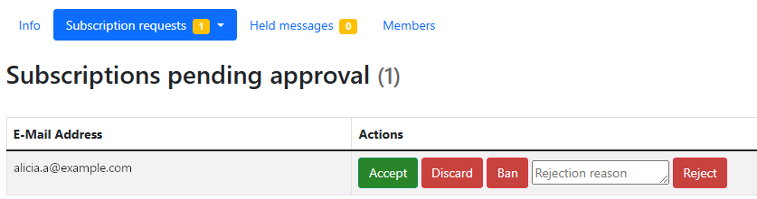
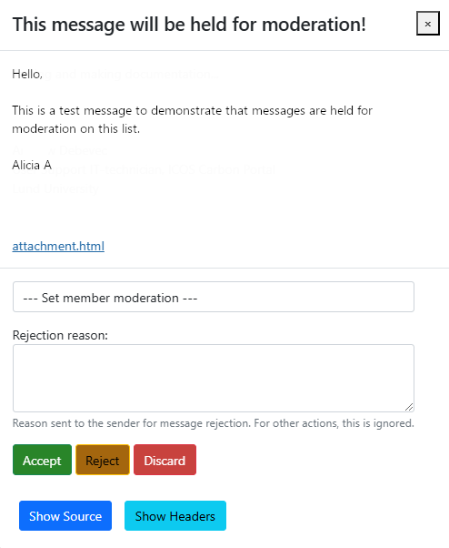

# List moderation (requires Moderator role)

After signing in to the [ICOS Mailing Lists home page](https://lists.icos-ri.eu),
you can use the **Moderator** button in the Role Selection area to display all
of the mailing lists that you are a moderator of. 

In addition to the list overview, there are two additional menu options that you
can use: **Subscription requests** and **Held messages**. You can also access
these moderation pages by following the link in the emails that you will get as
a moderator when an action is required.

## Subscription requests

Clicking on the **Subscription requests** option will open a drop-down menu,
allowing you to view different kinds of requests: those **Pending Approval**,
**Pending Confirmation**, and **Unsubscription Requests**. Note that the number
to the right of **Subscription requests** lists how many requests require action
from a moderator.

You can click on the option from the drop-down menu to open the corresponding
page.

**Pending Approval** is the most commonly used page, as this displays people who
have put in a subscription request, confirmed their email, and are waiting for
their subscription to be accepted.

Click the **Accept** button to allow this address on the mailing list. The
**Discard** button will delete the request without notifying the user. The
**Ban** button will discard the request and also prevent the user from trying to
subscribe again. Finally, you can optionally enter a *Rejection reason* and then
click the **Reject** button to reject the user's request and inform them of the
rejection, sending the reason to them as well.

The **Pending Confirmation** page will show you which users have attempted to
subscribe but have not confirmed their email address.

The **Unsubscription Requests** page will show you requests to unsubscribe from
a list, if this is enabled. *This is usually not enabled, so the section will
simply be empty.*

## Held messages

If a mailing list is moderated, then messages will be held until a moderator
approves them.

!!! note
    You should approve of messages in a timely manner, as the original
    timestamp of the message will be maintained. So if a message is held for three
    months, and then approved, it will be sent at the current time but appear as
    though it was sent three months ago.

Click on the **Held messages** option and you will see any held messages
displayed in a table. 

If there are many messages and you do not need to view the contents, you can use
the checkboxes on the table to select messages, and then the buttons above the
table (to the right) to perform the bulk action of **Accept**, **Reject**, or
**Discard**.

You can click on the **Subject name** of a message to view its contents, and
from there, you can **Accept**, **Reject**, or **Discard** the message. You can
also provide a rejection reason, which is sent to the sender when you reject the
message.

There is also an option to **Set member moderation**. This allows you to set an
action that should automatically be taken anytime a message from this sender is
received. You can always *Hold for moderation*, *Reject (with notification)*,
*Discard (no notification)*, *Accept immediately (bypass other rules)*, or use
the *Default processing* choice.