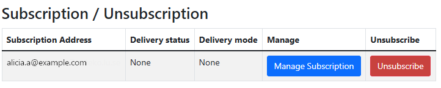
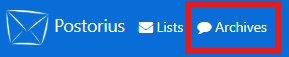

# Manage your subscriptions and settings

After signing in, you can manage your subscriptions, change your settings, and
subscribe to new lists.

## Subscribing

After signing in to the [ICOS Mailing Lists home
page](https://lists.icos-ri.eu), you will see a table of the mailing lists you
are currently subscribed to, or have a Moderator or Owner role in. If you click
on the **All** button in the Role Selection area, you will be able to see all of
the mailing lists that you can subscribe to.

To subscribe to a list, click on the list's name. You will then see a section
named **Subscribe to this list**. Here, you can select which email address you
would like to use for this list, your name, the delivery mode for the list, and
the delivery status. (For more information about these settings, see [Manage
delivery preferences](#manage-delivery-preferences) below.)

After filling out the form (or leaving it with its default values), click the
**Subscribe** button. If the list membership is unmoderated, you will receive an
immediate notification email confirming your subscription; otherwise, you will
have to wait for the list moderator to approve your membership.

## Unsubscribing

Click on the **Member** button in the Role Selection area to view lists you are
subscribed to. Then, click on the list name. You will now be able to click the
**Unsubscribe** button to unsubscribe from the list.

## Manage delivery preferences

### Global Mailman preferences

To access the Global Mailman preferences, click on your name/profile picture in
the upper right corner of the screen. Then, select **Mailman Settings** from the
drop-down menu. Click on the **Global Mailman preferences** tab to access the
menu.

There are several preferences that you can change, which apply to all of the
lists you are subscribed to. These settings are the "default settings" that
apply to any list you are subscribed to. You can override the settings for
specific lists by changing your [List-based
preferences](#list-based-preferences).

Here is a detailed list of the settings you can change and what each selection
does:

- **Delivery status**: By default, *Enabled* is selected, which means you will
receive mail from the mailing lists you are subscribed to. You can disable all
email delivery while remaining subscribed to the mailing lists by selecting
*Disabled*. **Note that this will not automatically revert, so you will need
to return to this page to re-enable mail delivery in the future.**
- **Delivery mode**: By default, *Regular* is selected, which means you will
receive each email sent individually. If you would prefer to receive fewer
messages, you can select one of the *Digest* options, which means you will
receive mail sent to the list in batches, usually once per day for each list.
Generally, the *MIME Digests* option is the best option, but if your email
client does not display messages properly, you can select *Plain Text
Digests*. (Note that *Summary Digests* is currently equivalent to the *MIME
Digests* option.)
- **Receive own postings**: By default, *Yes* is selected, which means you will
receive your own email messages when you send them to a list. If you would
prefer to not receive your own messages, select *No*.
- **Acknowledge posts**: By default, *No* is selected, which means you will not
receive acknowledgment emails when you send mail to a list. You can opt to
receive acknowledgment messages, confirming you have successfully sent mail to
a list, by selecting *Yes*.
- **Hide address**: By default, *Yes* is selected, which means your email
address will not be visible to other members of the mailing list. If you do
not wish to hide your email address, select *No*.
- **Receive list copies (possible duplicates)**: By default, *Yes* is selected,
which means you will receive additional copies of some messages if you are
explicitly included in the To: or CC: fields. You can select *No* so that the
mailing list will detect and not send messages if you are already included in
the To: or CC: fields.
- **Preferred language**: By default, *English (USA)* is selected. You can
change this by selecting your preferred language for your interactions with
the mailing list system, which will change the language used in your email
notifications (but will not affect the mailing lists home page).

!!! note
    Remember to click the **Save changes** button when you are finished making
    your selections.

### Address-based preferences

To access the Address-based preferences, click on your name/profile picture in
the upper right corner of the screen. Then, select **Mailman Settings** from the
drop-down menu. Click on the **Address-based preferences** tab to access the
menu.

If you have multiple email addresses configured, such that some lists use one
email address while other lists use another, you can manage the delivery options
for each email address so that certain settings are overridden for an email
address. (To set this up, see [Account settings](#manage-account-settings) to
add other email addresses, and [List-based preferences](#list-based-preferences)
to select a different email address for a specific list.)

Refer to the [Global Mailman preferences](#global-mailman-preferences) for
explanations of each setting, and then change them as you would like in the
table. Click **Save** to save your changes.

### List-based preferences

To access the List-based preferences, click on your name/profile picture in the
upper right corner of the screen. Then, select **Mailman Settings** from the
drop-down menu. Click on the **List-based preferences** tab to access the menu.

You can override the Global Mailman preferences for specific lists here. Refer
to the [Global Mailman preferences](#global-mailman-preferences) for
explanations of each setting. You can either change options within the displayed
table, and then click **Save** to save your changes, or click on a specific list
name to change the settings for that list. 

In additon to overriding the Global Mailman preferences, explained above, you
can change an additional setting for a specific list after clicking into the
list:

- **Select Email**: You can select an alternate email address for a specific
  list to send email to. (You can add an email account by changing your [Account
  settings](#manage-account-settings), shown below on this page.)

!!! note 
    If you are changing the email address to deliver to, remember to click the
    **Change email used for subscription** button. If you change any of the
    other preferences, remember to click the **Save changes** button when you
    are finished making your selections.

## Manage account settings

To manage your account settings, click on your name/profile picture in the upper
right corner of the screen. Then, select **Account** from the drop-down menu.
You will see several buttons to allow you to navigate between different tabs:

- **Account**: You can change your username, first name, last name, and time
zone.
- **Change Password**: You can change your password.
- **E-mail Addresses**: You can add additional email addresses by typing the
address in the Email address box and clicking the **Add E-mail** button. You
can also see the verification status of each email address, use the **Re-send
Verification** button to re-send a verification email, use the **Make
Primary** button to make a different email address the primary email address
of your account, or **Remove** email addresses.
- **Delete Account**: You can delete your account.

## View past mail sent to a mailing list (list archives)

!!! attention
    Due to a known bug, the list archive is currently not operational. We hope
    to have it operational again soon!

To view the list archives, click on the **Archives** link in the header, near
the upper left section of the screen.

Here you can see the available lists that you have access to. Click on a list
name to view the archive of that list.

The default landing page will show you the past 30 days of activity. Click on
the **All threads** button, in the column to the right, to view every message.
You can also use the **Threads by month** menu to select a specific month to
view.

You can use the search box in the upper right to search through the mailing
list's archive as well. 