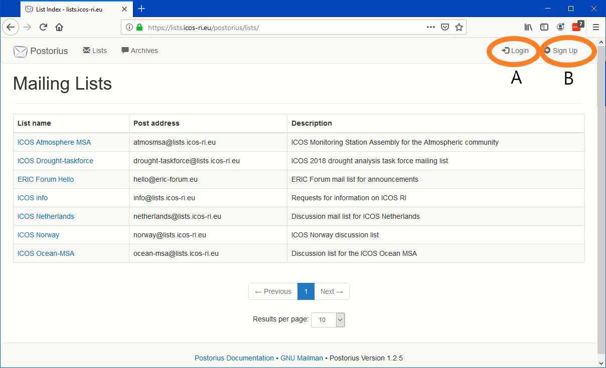
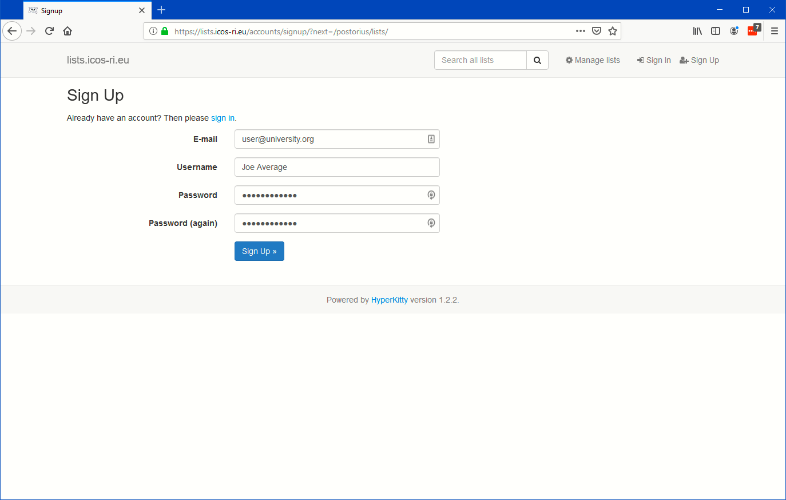
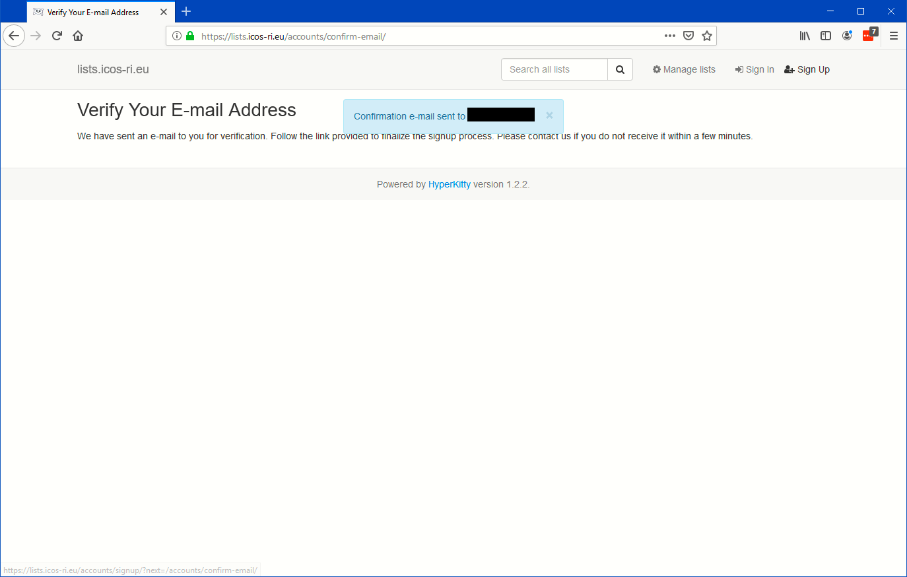
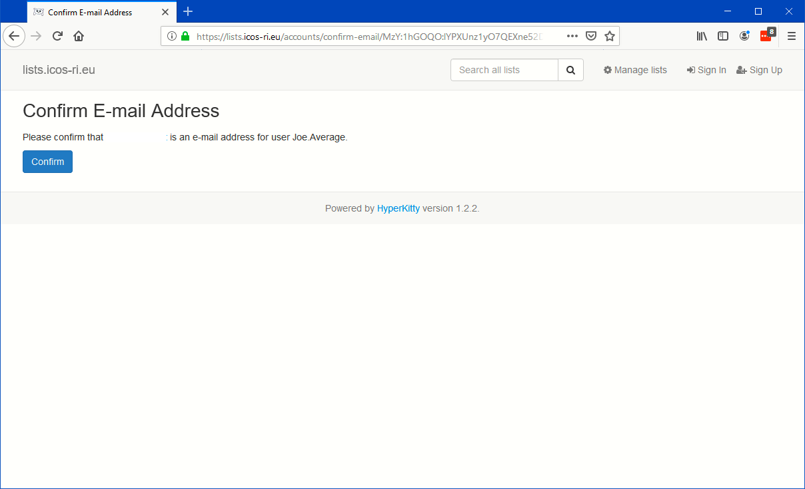
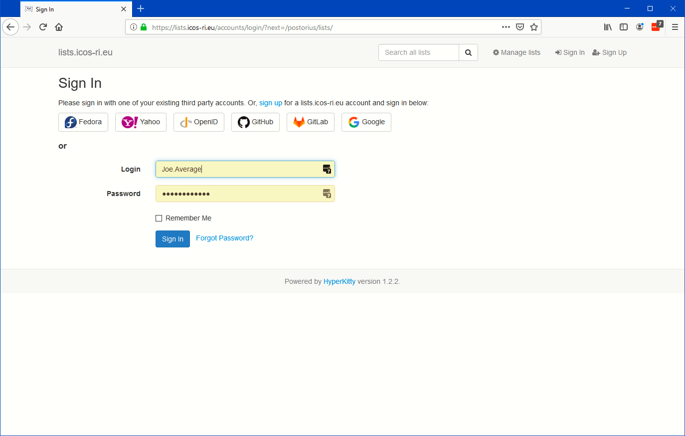

==================
Register and login 
==================

To make use of all functions of the mailing list server, for example as moderator or list owner but also for normal users to change their preferences, it is needed to login to the list server web interface at https://lists.icos-ri.eu. For this you first need to Sign Up.
When you open the web interface you will be redirected to the Posterius interface, which controls the mailing list settings. You will be presented with the list of published mailing lists at the ICOS list server, as in the below picture.

Signing Up
----------

If you do not have a user account yet for this ICOS mailing list service, please click the Sign-Up button marked with B on the first picture above. Otherwise login by entering the Login button marked with A. And continue reading at the final section of this page.

When you choose Sign Up you will be presented with a simple form as below to enter the minimum information, including an email address, a password and a user name. In principle you should choose the same email address that you use for other ICOS related business. You can later through the web interface of the email lists always change to another email address in case your
email address has changed. For the user name you can choose any string (no spaces and special characters, except '.' and '_'), you can always also login using the registered email address.

After filling in the form press the Sign-Up button. The system will confirm that an email has been sent to the address you provided

If all goes well you will receive within a few minutes a confirmation email on the email address you entered, the mail will look like below. 

.. image:: lists-confirmmail.png

Please confirm by clicking the link contained within the email and acknowledge your signing up by clicking on the Confirm button on the confirmation webpage as below

After this you will be directed to the login page of the lists service that will look like below. Please fill in here the username or email address and password you just registered and press the Sign In button. Please note that this login page also has a forgot password link on this page which allows you to set a new password in case you forgot yours. This procedure includes the same confirmation process through email. Please disregard for this moment the third party login options shown here, as they do not work (yet).

Logging in
----------

Now you will presented with the list of published lists plus the lists to which you have access as member, moderator or owner. Through the Filter by Role button you can now see to which lists you have a subscription (choose Member), where you are moderator or even owner. Select All again to see all lists to which you have access. 

.. image:: lists-signedin.png
