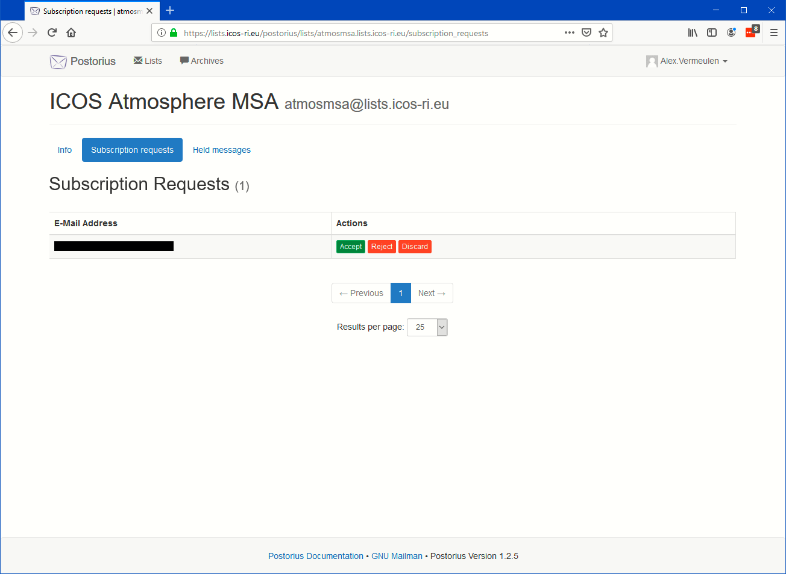
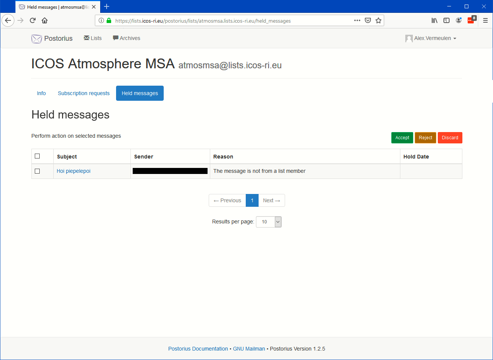

===================
Moderator functions
===================

When you access the list info (See :ref:`Subscribing`) or select one of the lists shown after selecting a list from the "Mailman Settings" (see :ref:`Account settings`) Subscription list, where you have the role of moderator there are two additional menu items visible on top of the overview names "**Subscription requests**" and "**Held messages**". Selecting one of these buttons allows you to moderate the email list subscriptions resp. messages.

You can also get to these moderation pages by following the link in the emails that you will get as moderator when an actions is required.

Subscription moderation
-----------------------

The subscription request moderation page looks as follows:

This page will show one or more requests in a table, here we have only one request. If all requests have been handled, for example by other moderators, the table will be empty. You have the choice to accept, reject or discard each individual request for subscription. In case you select discard, the user will not be notified by email of the rejection. In the other cases the user will be informed of your decision. 

Message moderation
------------------

The message moderation page looks as follows:

This page will show one or more requests in a table, here we have only one request. If all requests have been handled, for example by other moderators, the table will be empty. You have the choice by selecting the tick boxes to accept, reject or discard each individual request, one by one or several at the same time, for message moderation. In case you select discard, the user will not be notified by email of the rejection. In the other cases the user will be informed of your decision. 

Messages can be selected for moderation because the list is moderated or because the message is too large for example because it contains a large attachment. The list owner can also determine that messages from certain email addresses are always to be moderated (as softer alternative for blacklisting the address).

