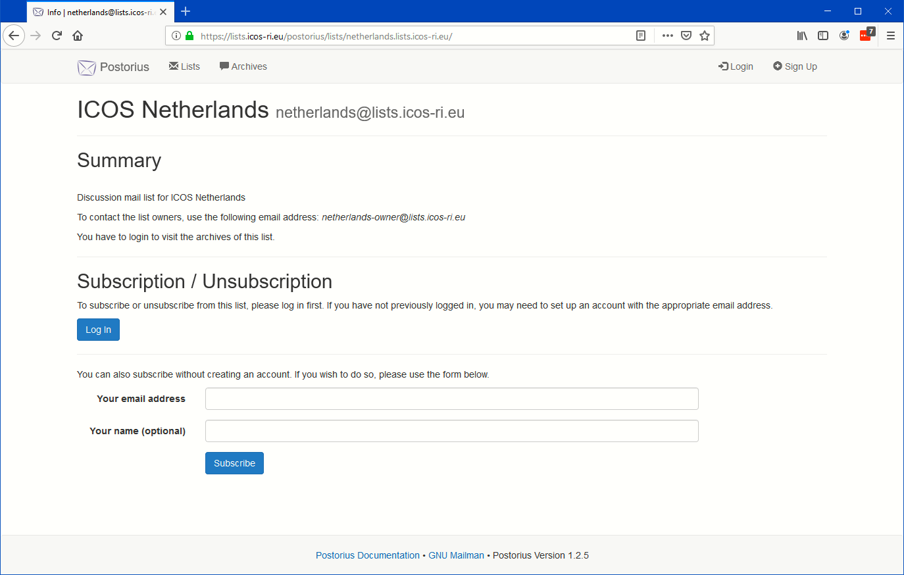

======================
Access without account
======================

To make use of the mailing list server please go to the list server web interface at https://lists.icos-ri.eu. You will first be presented with an overview op the list of published mailing lists at the ICOS mailing list server, as in the below picture.

.. image:: lists-start.png

Even without logging in you can already subscribe to one of the lists shown at https://lists.icos-ri.eu by clicking on one of the List names. You will then be presented with a form as below where you can enter your email address and name. Then press the Subscribe button. If the list membership is moderated you will have to wait for the list moderator to approve your membership, otherwise you will get an immediate notification email of your subscription.

