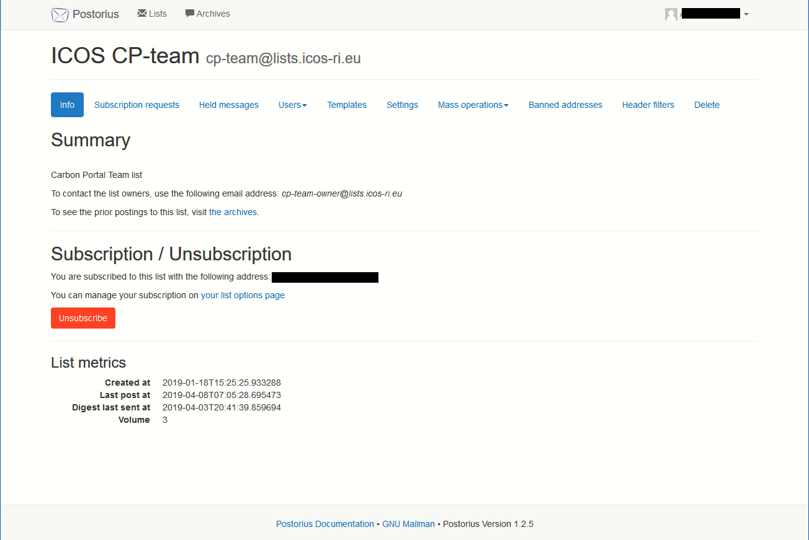
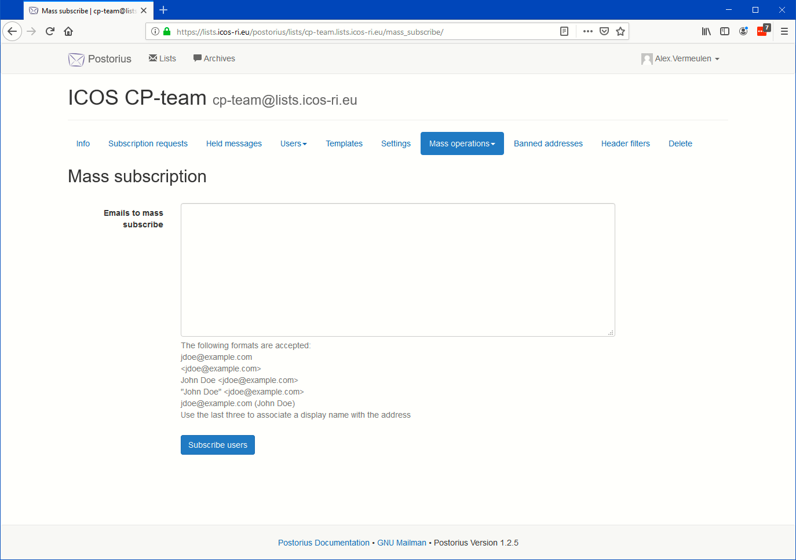

===============
Owner functions
===============

**Warning**
-----------

As list owner you have powerful options to change the way that the list behaves. Use that power with **CAUTION**! You have the power to wipe the whole list and unsubscribe all users!

The special owner menu
----------------------

If you have the role of moderator and access the "**List info"**" (See :ref:`Subscribing`) or select one of the lists shown after selecting a list from the "**Mailman Settings**" (see :ref:`Account settings`) Subscription list, there are a lot of additional menu items visible on top of the list overview page, as shown below 

We will not cover all options, but only the most important ones. The options not covered here should only be used after consultation of the administrator at ICOS Carbon Portal at info@icos-cp.eu.

Change the list settings
------------------------

For the list settings we will only treat the Message Acceptance options here. For this choose "**Settings**" from the menu. A new extensive sub-menu will be shown below the main menu that inlcudes the "**Message Acceptance**" submenu. Select this option and the following form will shown

.. image:: lists-acceptance.png

The most important settings are:

"**Default action to take when posting**": There is an option for non-members and for members. For each of the categories you can choose to accept immediately, discard with or without notification of the user, or to set moderation. Default processing means that only the standard Mailman checks (file size, spam check) are performed before the message is accepted. For closed mail lists you can opt to discard all non-member posts to minimize the risk of spam to the list.

"**Maximum message size**" (in kilobytes, including attachments), never let this exceed 5 MB. Big files should not be shared by email but should be linked to from some cloud source. 

User options
------------

Add or remove users/moderators/owners 
^^^^^^^^^^^^^^^^^^^^^^^^^^^^^^^^^^^^^

To add members, moderators or owners, choose the **Users** menu option and the corresponding option in the sub menu. 

When you choose the **Members** option you will see a table with all subscribers. You can select a set of individual members by ticking the tick boxes and unsubscribe them. 

When you choose the **Moderators** option you can add a new moderator or delete the existing one(s).

When you choose the **Owners** option you will be able to add a new list owner or remove the existing one(s)    

Change individual user settings
^^^^^^^^^^^^^^^^^^^^^^^^^^^^^^^
 
Here you can set the default options for individual users of this list for e.g. delivery mode and acknowledgements. See :ref:`Delivery options`. You also can change the moderation options for the individual user. For this choose "**Users**" from the menu and then "**Members**" from the submenu. For the user that you want to modify choose the "**Member options**" link on the right of the user name. For example you can use this to have the messages of one specific user moderated in a non-moderated list or have one user without moderation in a further moderated list.

Mass subscribe
------------------

In order to add one or more members to the list choose **Mass operations** and select **Mass Subscribe**. You will be shown a form like shown below

Just add in plain text a list of email addresses to the text box in the middle of the form, one per line. The possible formats are displayed below the box. You can for example paste one or two columns from Excel with the required data direct in the box. 

After the list is complete press the **Subscribe users** button. The program will list for each entry whether the addition was succesfull or not. In case of errors correct them and try to add the missing email addresses again.

