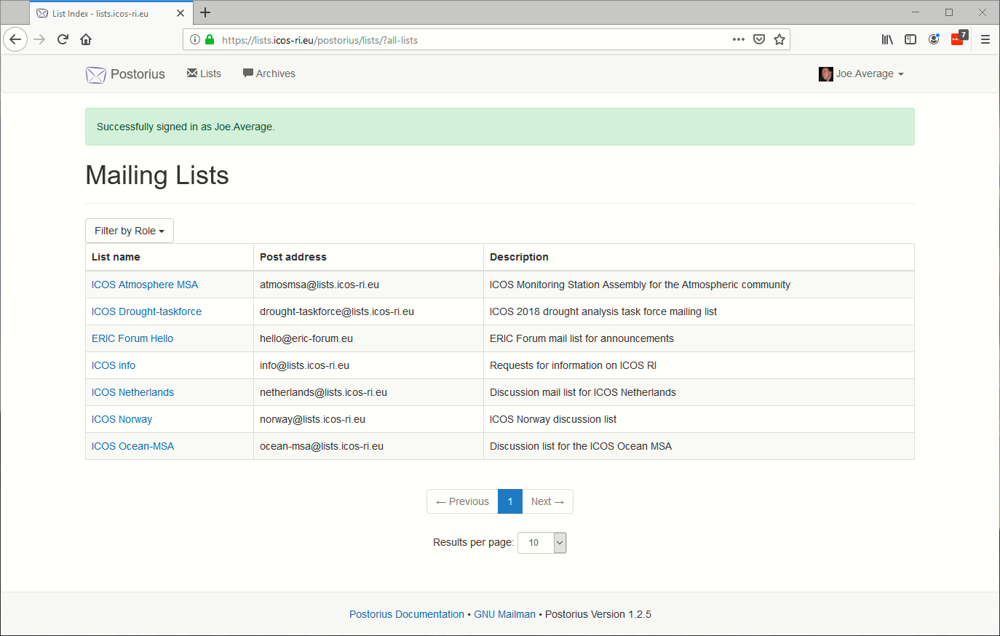
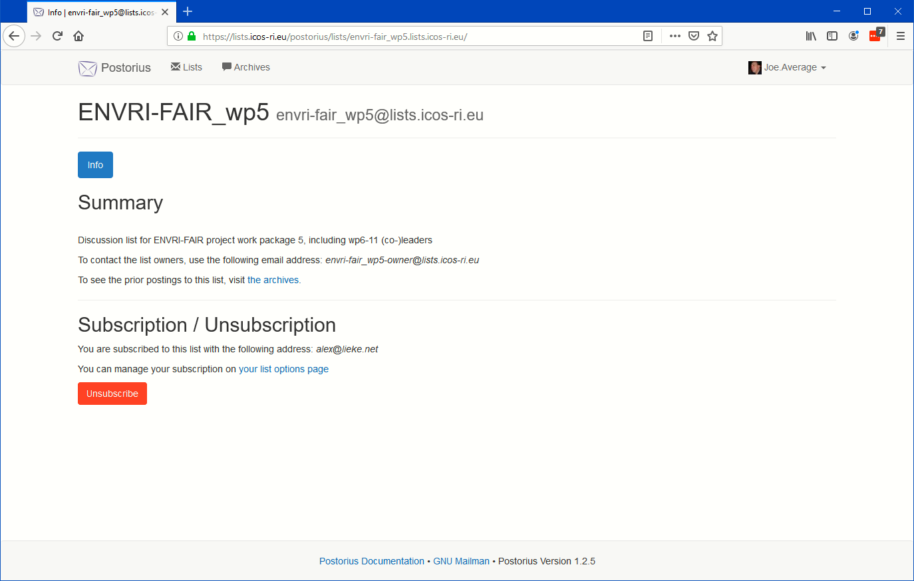
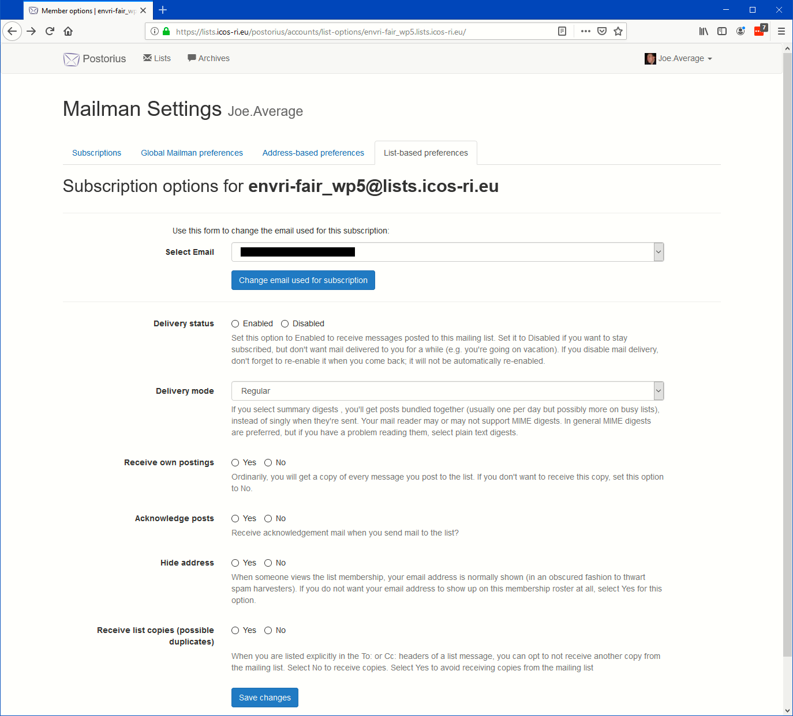
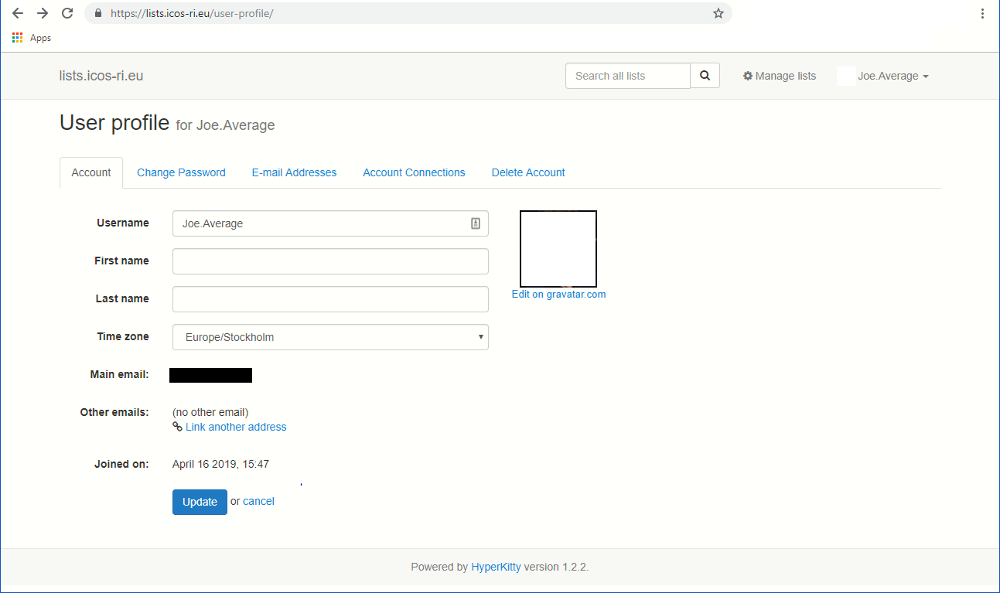
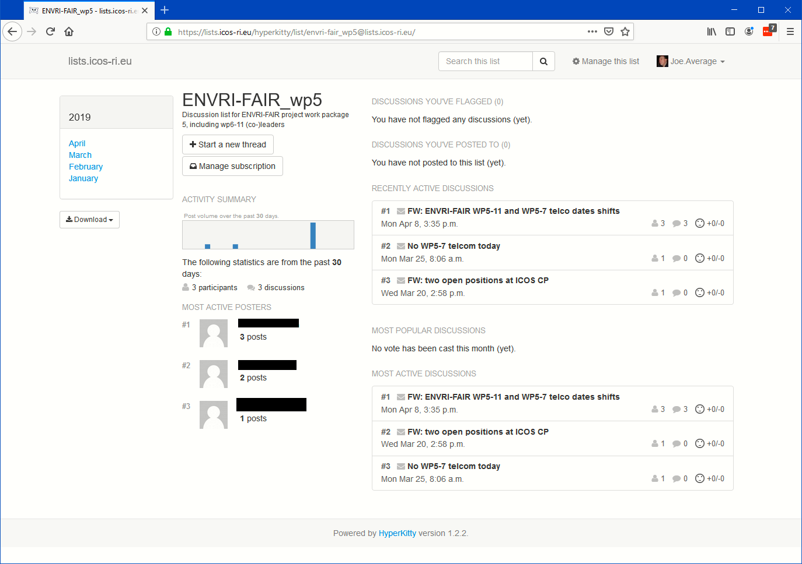

=========================
Registered user functions
=========================

Subscribing
-----------

From the list of mailing lists that is shown when you login to https://lists.icos-ri.eu as below you select Filter by Role and choose All. You will then see all mailing lists that you have access as member, moderator or owner.  

Now click on one of the entires in the column name "**List name**" and you will see the options for this list that you have access to. If you are not subscribed to the list it will offer a button "**Subscribe**", if you are subscribed already it will offer the button "Unsubscribe" as below. 

If the membership of the mailing list you subscribe to is moderated you will have to wait for the moderator to approve your membership and you will receive a notification of the result. If there is no moderation of membership you will receive a notification of your membership by email to your registered email address within a few minutes.

Unsubscribing
-------------

This follows the same routine as described in `Subscribing`_, just select the unsubscribe button and you will be unsubscribed immediately. 

Change your settings
--------------------

When you select a mailing list from the overview like in `Subscribing`_ there is also a link shown that leads you to the option page for this list. When you follow this link the following options are shown

Here you can change at the top the email address registered for you for this email list. Select one of the already registered alternatives from the drop down menu and select the "**Change email use for subscription**" button. After this press the "**Save changes**" button on the bottom. You can register new email addresses for your account see `Account settings`_ 
 
Delivery options
^^^^^^^^^^^^^^^^

The page you reached in `Change your settings`_ also allows you change the delivery options for this email list. They will override the "**Global Mailman preferences**" and "**Address based preferences**" that can also be reached from the tabs on top of the form on this page. The options are toggles or dropdown. If nothing is selected the address based resp. global prefenernces will apply. 

You can change the "**Delivery status**" to Disabled. This will stop the delivery of email messages from this list until you re-enable. If the Global or Address-based preference is set to Disabled you can set it to Enabled for this one email list here so that only this specific email list will be delivered while all the others are not delivered.

With the "**Delivery mode**" setting you can select to only receive (mostly) daily digests of this list that bundels alle emails received after the previous digest. If your email reader does not support MIME disgest select plain digests.

You can force here to not receive emails from the list that you sent yourself through the "**Receive own postings**" option

You can also request to receive a confirmation of every mail you sent to the mailing list, for example if you receive digests and want to know faster that your email has reached the email list.

Always press the "**Save changes**" button to make sure that the changes in the settings you have made become active.

From the tab labelled "**Subscriptions**" you can access an overview of all the lists you are subscribed to and/or have a role of owner or moderator.

Account settings
^^^^^^^^^^^^^^^^

The Settings menu can be reached for logged in users by clicking on your user name on the top right. You can change then your "**Account**" settings. 

For example you can add an avatar, set the correct timezone, add alternative email addresses under tab "Email addresses", specify your First and Last Name, change your password, set the primary email address used for notifications, (re-)verify your email address(es), and delete your complete account including all your personal information from "**Delete account**".    

From the settings menu you can also directly change the Mailman settings that we discussed under delivery options, including the overview of the subscribed email lists, to which address the email is delivered to you and your roles, with consequent access to the summary information of all these email lists, where you can unsubscribe or access the archive of that list.

Finally the settings menu gives you access to an overview of your posting activity and allows you to log out from the user interface.

Use the list archive
--------------------

From anywhere in the lists system you can always access the list archives by choosing the "**Archive**" menu item on the top left. The archive for an email list can also be reached from the list overview as show on top of this help page. It looks like shown below:
 

The page gives an overview of the most recent messages that you can read here by clicking on the bold subject lines. You can upvote or downvote a message, reply from here directly, download the current thread as a zip archive of MSG files, see who contributed to the thread, and on the left go back to other months and years to look for older messages.     

You can also start a new thread and post the first message of this thread to the list directly from here.

Finally you can manage your subscription to this list from here as well. 
