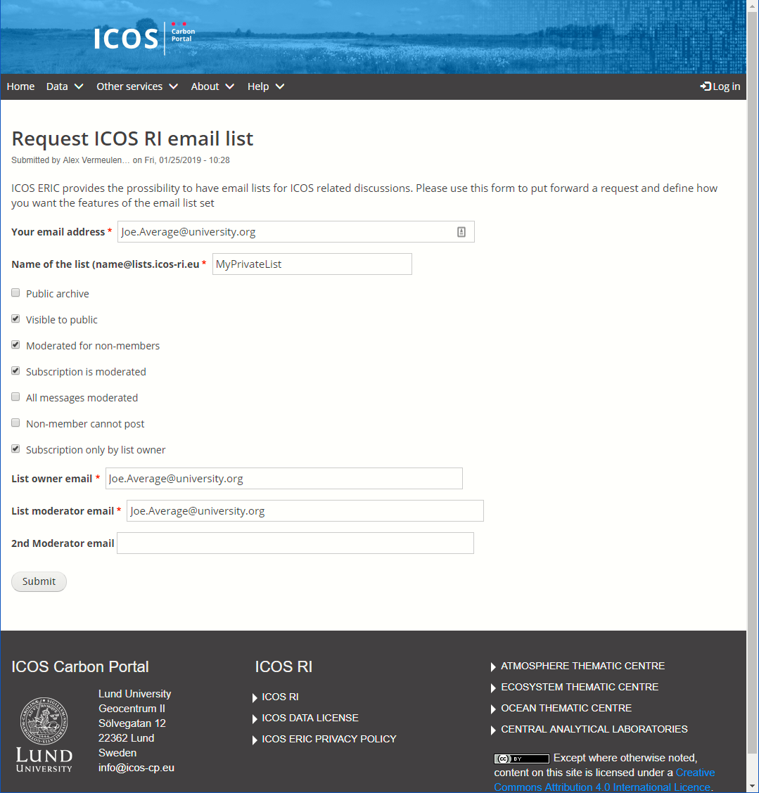

==============================
Request your own email list(s)
==============================

It is possible for members of the ICOS community to request the creation of a dedicated mail list on lists.icos-ri.eu for a project, group or other purposes. For this we created a web form that you need to fill in. After approval a lmail list will be created and you will get notified. The web form can be found on https://www.icos-cp.eu/emaillist_request and this is how it looks:

First fill in your email address for the notifications. Then choose a name for the email list. Do not include the @lists.icos-ri.eu part, this will be added automatically at creation.
Then there is a number of options that decide how visible the list will be for the outside world. 

You can choose to have a public archive so that anybody can read all messages sent to the list. In most cases you do not want this and then the archive will be only visible to members of the list. 

The list can be announced on the starting page of lists.icos-ri.eu for anybody, this is called visible to public. If you do not select this only members can see the list when looged in.

Moderation can be set for messages, either just for non-members or for all.

Also subscription can be set to be moderated, we will always ask for confirmation of the mail address by the subscriber before the request is moderated or allowed.

For closed lists you can choose to not allow non-members to post.

The final option is to have the moderation of subscriptions only done by the list owner and not by the moderators.

After setting the email addresses for the list owner and moderator(s) (they must have accounts on the lists.icos-ri.eu of course) press the submit button. You should receive an automatic notification of your rerquest to the email address you provided.

Within a few working days the list will be created and you and the owner and moderator(s) will be notified when it is done.