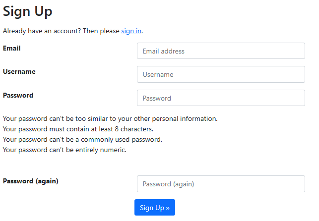
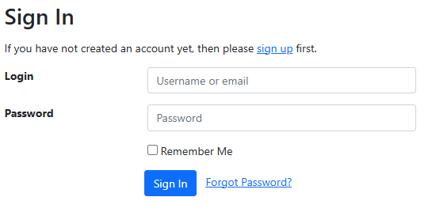
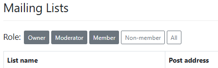

# Create an account

In order to access all of the functions of the mailing lists, including changing
your preferences, unsubscribing, or performing list moderation/ownership tasks,
you will need to create an account.

## Signing up

From the [ICOS Mailing Lists home page](https://lists.icos-ri.eu), click on the
**Sign up** link in the upper right corner of the screen. Fill out the form by
providing your email address, a username, and a password, and then click **Sign
Up**.

!!! note 
    We recommend signing up using the same email address you use for other
    ICOS-related business. If your email address changes, you can update the
    email address you are using by logging into the home page.

After signing up, you will receive a confirmation email to the email address you
entered. Click on the link contained within the email, and then click on the
**Confirm** button.

Now, from the [mailing lists home page](https://lists.icos-ri.eu), click on the
**Sign In** link in the upper right corner of the screen. Provide your username
or email, as well as your password, and click **Sign In**.

!!! note 
    You can use the **Forgot Password?** link on this page to reset your
    password, as long as you have access to the email account you used to set up
    your account.

## After signing in

You will now be presented with a table displaying all o fthe lists in which you
are an owner, moderator, or member., in addition to lists to which you have
access as member, moderator or owner. You can select a role using the buttons to
the right of the word *Role:* in order to filter the list, allowing you to
display the lists for which you are an **Owner**, **Moderator**, **Member**, or
**Non-member**, in addition to being able to display all lists. 

{!../contact_footer.md!}