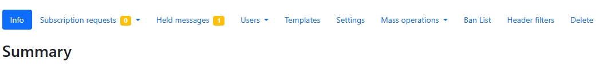
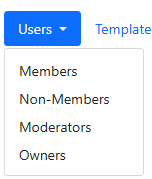

# List ownership (requires Owner role)

!!! warning
    As list owner you have powerful options to change the way that the list
    behaves. Use that power with **CAUTION**! You have the power to wipe the
    whole list and unsubscribe all users!

After signing in to the [ICOS Mailing Lists home
page](https://lists.icos-ri.eu), you can use the **Owner** button in the Role
Selection area to display all of the mailing lists that you are an owner of.
Then, you will be able to see many additional options on the list overview page:

!!! note
    We will only be covering the **most important, commonly used** options here.
    Other options should only be used after consultation with the staff of the
    [ICOS Carbon Portal](mailto:info@icos-cp.eu)

## Managing users

Click on the **Users** option to open a drop-down menu displaying the various
types of users that you can manage:

### Add or remove members/moderators/owners 

To add members, moderators or owners, select the corresponding option from the
Users drop-down menu. 

When you choose the **Members** option, you will see a table with all
subscribers. To unsubscribe multiple members, you can select them by checking
the checkboxes next to their email addresses, and then click the **Remove
Selected** button.

When you choose the **Moderators** option, you can add a new moderator or remove
existing moderators.

When you choose the **Owners** option, you will be able to add a new list owner
or remove existing owners.

### Change individual user settings

If you go to the **Members** section, you can change an individual user's
settings for your mailing list by clicking on their email address, which opens
the **Subscription Options** page.

!!! note
    You can review [Manage delivery
    preferences](manage_subscriptions.md#manage-delivery-preferences) for a
    detailed explanation of each setting.

You can also change the moderation options for an individual user. At the bottom
of the **Subscription Options** page, you can find the **Moderation** option.
This allows you to set an action that should automatically be taken anytime a
message from this user is received. You can always *Hold for moderation*,
*Reject (with notification)*, *Discard (no notification)*, *Accept immediately
(bypass other rules)*, or use the *Default processing* choice.

## Settings

Click on the **Settings** option to open the **List Settings** page. This opens
up a secondary menu, in a column at the left side of the screen.

We will only be discussing the **Message Acceptance** section here. Click on
**Message Acceptance** from the menu to open those settings.

There are two settings that can be useful for you to change:

- **Default action to take when posting**: There are two settings for this,
which allow you to set the default action taken when a message is received from
a user, depending on whether they are a member or a non-member. You can choose
to *Hold for moderation*, *Reject (with notification)*, *Discard (no
notification)*, *Accept immediately (bypass other rules)*, or use the *Default
processing* choice. For closed mail lists, you may prefer to automatically
discard all non-member posts in order to minimize the risk of spam to the list.
- **Maximum message size**: You can define a maximum message size, in kilobytes
(KB). Large files should not shared on the mail server, so do not set a limit
higher than 5000 KB. Instead, large files should be uploaded to a cloud server
and linked to. (For example, you could use the [ICOS
Fileshare](https://icos-carbon-portal.github.io/fileshare/) to host
files.)

## Mass subscribe

You can select **Mass operations** and then **Mass Subscribe** to add many users
to the mailing list at once. 

Here, you can simply paste in a plain text list of email addresses to the
*Emails to mass subscribe* text box, one per line. The possible formats are
displayed below the box. You can, for example, paste one or two columns from
Excel with the required data directly into the box. 

After entering the email addresses, click the **Subscribe users** button. The
mailing list server will try to add each user to the list, and will then notify
you of whether each addition was successful. If there is an error, you can
correct them and try to add them again.

{!../contact_footer.md!}