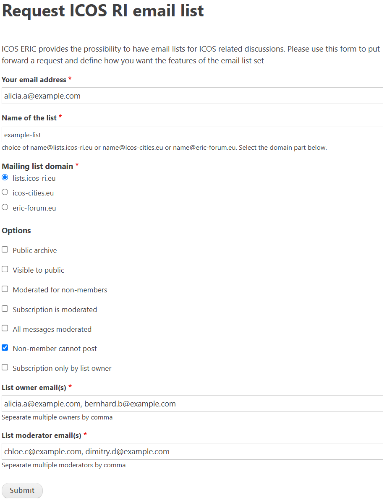

# Request a new mailing list

As a member of the ICOS community, you can request a new mailing list for a
project, group, or other purpose.

In order to do so, please [submit a request
here](https://www.icos-cp.eu/emaillist_request). A completed request is shown below:

Fill in your email address, which we will use to notify you of the list's
creation, and choose a name for the email list and the mail list domain you
would like to use. The will determine the email address of your list (Name of
the list + Mailing list domain)

Next, you can select which options you would like, determining how visible the
list is and how you want the list to be moderated.

- **Public archive**: Enables a public archive of your mailing list, allowing
  anybody to read all messages sent to the list.
- **Visible to public**: Allows the list to appear on the [ICOS mailing list
  home page](https://lists.icos-ri.eu) to non-members.
- **Moderated for non-members**: Enables moderation for emails sent from
  addresses that are not subscribed to the list.
- **Subscription is moderated**: Enables subscription moderation, which requires
  subscribers to be approved by a moderator before being added to the mailing
  list.
- **All messages moderated**: Enables moderation for all emails sent to the
  list, including those from members. This is useful for lists that are intended
  for announcements rather than discussion.
- **Non-member cannot post**: Limits mail to the list to only be sent by
  members; non-member emails will be discarded entirely rather than held for
  moderation.
- **Subscription only by list owner**: Users may be subscribed to the list only
  by a list owner. Subscription moderation can occur, but only an owner of the
  list will be able to approve subscribers.

Finally, add the emails of the list owner(s) and moderator(s). They must already
have accounts on the [ICOS mailing list](https://lists.icos-ri.eu). Click the
**Submit** button, and then you should receive an automatic notification
confirming your request was submitted.

The list will be created within a few working days, and you, the owner(s), and
the moderator(s) will be notified when it is ready.

{!../contact_footer.md!}