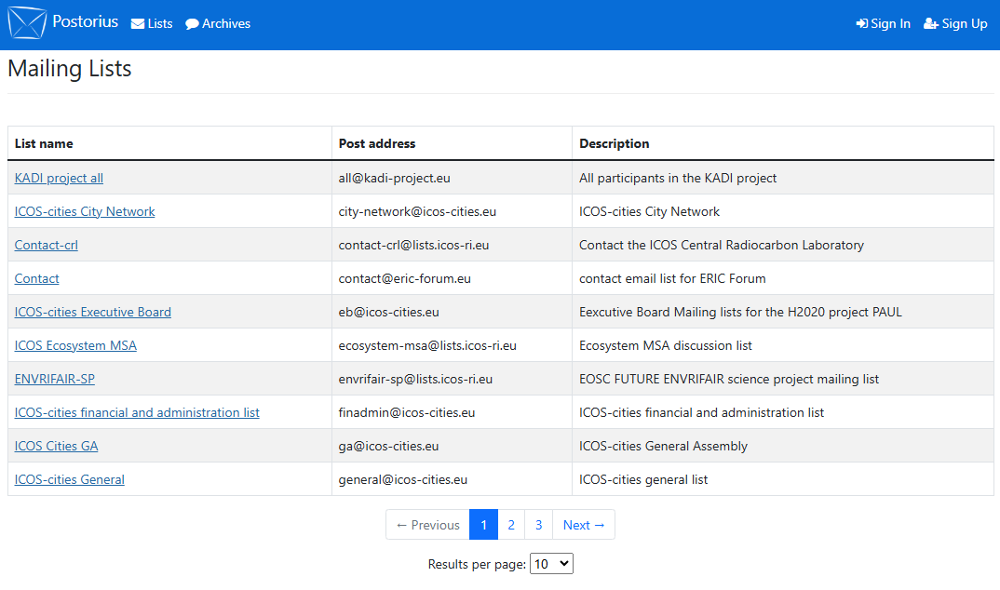

# Subscribe to a mailing list without an account

You can use the [ICOS Mailing Lists home page](https://lists.icos-ri.eu) without
having account to subscribe to public mailing lists. You will first be presented
with an overview of all published mailing lists on the ICOS mailing list server,
as shown below.

You can subscribe by clicking on one of the list names. Fill out the form, shown
below, and then click the **Subscribe** button. You will then usually receive an
email asking you to confirm your email address. To confirm your address, just
click **Reply** on the email, and then send it back to the server.

If the list membership is unmoderated, you will receive an immediate
notification email confirming your subscription; otherwise, you will have to
wait for the list moderator to approve your membership.

{!../contact_footer.md!}